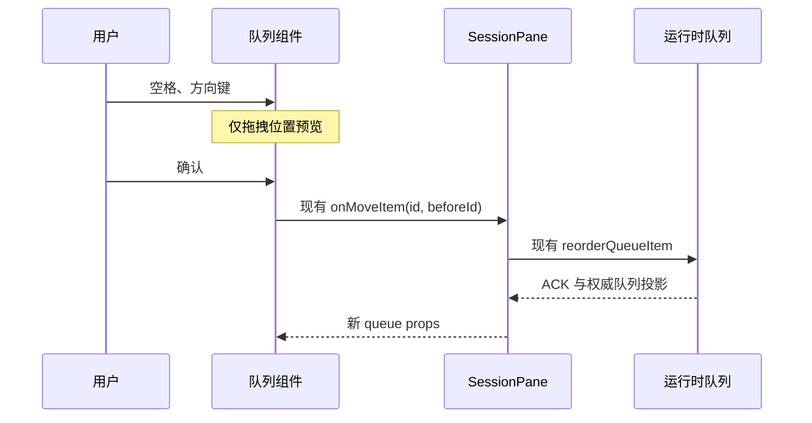

# 聊天队列键盘操作与滚动导航

## 用户问题

- 队列排序按钮可聚焦，并由 dnd-kit 提示空格开始，但组件只注册 PointerSensor，键盘无法排序。
- 导航每次滚动重建全历史 Map；目录已经按 unitIndex 排序，滚动只需查询可见回合。

## 行为与边界

- 键盘：空格/Enter 开始与确认，上下键移动，Escape 取消；取消不得提交命令。
- 排序复用现有 onMoveItem → reorderQueueItem，运行时队列仍是唯一事实来源。
- reserved/promoting 或撤回编辑中的行保持锁定；没有排序回调时排序按钮禁用。
- 拖拽说明与开始、移动、提交、取消播报均中英双语；提交播报只说明已请求移动，不伪称服务端接受。
- 移动端操作按钮至少 40px 高，窄屏不挤掉主文本；桌面保持原紧凑密度。
- 导航输入沿用按 unitIndex 非递减排序的目录；二分查找代替全历史 Map 和 fallback 扫描，
  保持可见区域边界、非用户回合、同回合多问题与空列表行为。
- 不变更 Host、协议、接受队列、owner/lease 或桌面/远控交付语义。

## 验收

- 浏览器组件场景：首行下移、末行上移、Escape 取消、焦点保留、锁定行、无排序回调。
- 中英文读屏说明与播报、390px 窄屏不横溢、按钮触控尺寸。
- 真实组件和样式配合模拟命令回调验证；明确区别于真实 Agent admission 的全链路 E2E。
- 导航纯函数与旧实现对照：空/稀疏目录、重复 unitIndex、边界、非有限滚动值；
  大目录重复滚动基准与读取次数断言，避免仅凭机器耗时判定正确性。
