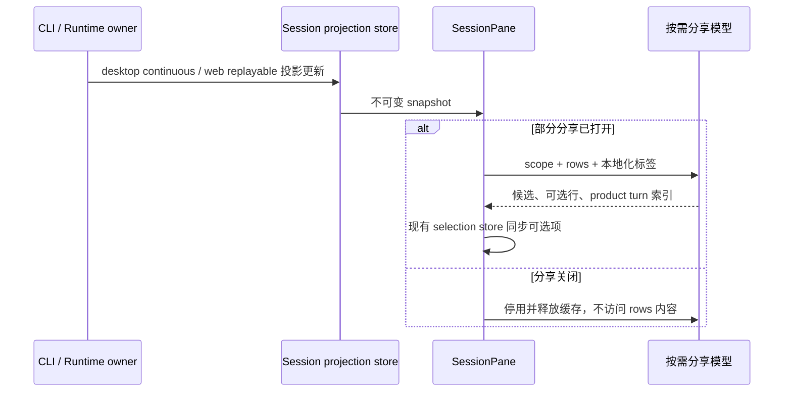

# 会话派生计算与桌面交互性能

## 规则与边界

- 普通聊天不计算分享目录、不建立分享行索引。进入部分分享后才计算，选择与配置阶段均保持候选同步；退出释放派生缓存。
- 分享模型属于 UI，只读取已发布的不可变 rows；选择事实仍由 conversationShareSelectionStore 持有，预检与发布走现有服务。按 workspace identity（本地 path fallback）、remote session、session 和 logEpoch 隔离缓存。
- 候选顺序、真实用户 query 粒度、运行状态、product turn 去重与现有构建器一致。分页、改写、回退、语言变化后不能出现旧候选。
- projection store 的订阅函数在同一 store 内稳定；换 lease/store 时退订旧 store。此调整不改变流式分发频率，也不更改远端恢复协议。
- 分享面板退出仍通过自身 AnimatePresence 完成；不为动画保留旧会话权威状态。

## Windows 与布局

- Windows 主窗口使用 Electron hidden title bar + titleBarOverlay 原生按钮，系统负责最小化、最大化、关闭与可用的 Snap Layouts。Linux 保留现有自绘按钮，macOS 保留红绿灯。
- Main 是原生窗控几何与主题的所有者。现有 WindowControlsOverlayMetrics 增加可选 nativeWindowControls 能力，preload 提供同步初值并转发更新，UI 只经 IPlatformService 读取。
- shared 的公开入口导出 WindowControlsOverlayMetrics、WindowControlsOverlayReadyPayload、DesktopZoomState；preload 与 UI 不跨包访问实现路径。缺少 nativeWindowControls 的旧平台适配器继续使用原有自绘分支。
- 所有现有 DesktopWindowControls 挂载点在原生模式输出统一避让空间，不渲染第二组按钮；zoom 后宽度反向补偿，冷启动与事件保持一致。
- Windows repaint 定时器在窗口关闭时释放。窗口缩放、最大化、托盘唤回不重载会话。
- 展开/收起继续遵循 Panel 注册后下一帧操作的时序；系统减少动画时不创建尺寸 transition，保留用户展开尺寸与快速反向操作的清理。
- 设置页首次懒加载提供主题一致、占满布局的加载壳，可返回，桌面标题栏和窗口操作持续可用；复用现有设计 token 与国际化文本。

## 验收

1. 分享关闭时输入不可读取的 rows，投影不触碰内容；开启、尾部流式更新、运行结束、分页、退出再进入结果正确。
2. 不同 scope 使用相同 row id 时没有缓存污染；语言切换更新文案。
3. 浏览器实际 hook 覆盖分享开关、流式更新、订阅稳定性、换 store 与卸载清理；覆盖面板展开/收起与减少动画模式。
4. Electron 隔离窗口验证原生 overlay、zoom 几何、最大化/恢复和关闭；Snap 浮层是否出现依赖 Windows 设置，未经实测不得宣称通过。
5. 根 typecheck、lint、架构检查；桌面 main 相关类型检查；记录已有失败与实际未验证的路径。

不迁移数据，不变更任务 admission、owner/lease、身份协议、历史持久化或手机 attachment 语义。
