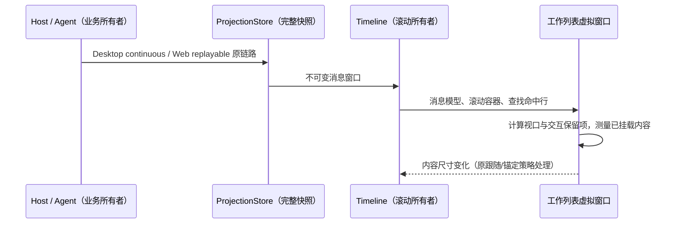

# 长单轮与桌面质量迭代

## 范围与所有者

- Timeline 继续拥有唯一滚动容器、跟随状态和轮次窗口；工作列表只拥有该容器内的测高与挂载窗口，不引入第二个滚动条。
- 40 项以内保持普通流布局；长工作列表使用现有 TanStack Virtual，按稳定 item key 测高，只挂载视口、预读和交互保留项。
- 查找索引仍来自完整消息模型。命中行即使离屏也先挂载；折叠历史因查找临时展开，清空查找后回到用户展开状态。复制整条回复继续使用模型全文。
- 正在选择的文字范围和键盘焦点不得因窗口回收消失；选择解除后释放保留项。原有工具展开状态的持久化路径继续有效。
- 宽度变化重新测高；组件卸载释放滚动、选择、测量订阅。Desktop 与手机 Web 共用此实现，不改变 Host / runtime 的 admission、owner、lease、序号和恢复协议。
- 后台展示暂停只能影响 UI 通知或绘制，不能停止 Agent、丢弃事件或改变已接受输入。
- 桌面主进程类型错误按真实协议和 Electron API 修复，纳入常规 typecheck；不忽略诊断、不扩大 any、不恢复退役功能。
- 产品身份遵循当前 shared/env 的 production 常量；移除不可达的 Preview 名称和强制灰度分支，开发态仍允许合法环境覆盖，生产包不继承本地灰度开关。
- Windows 沿用原生标题栏按钮；通过隔离 Electron profile 验证缩放、最大化与隐藏恢复，物理多屏 DPI 和 Snap 浮层需要实际设备交互证据。

## 验收

1. 5,000 项单轮的工作 DOM 随视口大小变化，滚动到中间/末尾无内容丢失；历史展开、连续流式输出、搜索、选择、复制与跳到底部正常。
2. 窄屏、分屏宽度变化、动态字体及减少动态效果时仍可操作；不通过强制折叠或截断数据换取性能。
3. 会话切换和后台更新在完整快照上恢复；不可见 UI 不制造逐 token 的无效渲染。
4. 压力用例同时记录数据规模、DOM 数、帧耗时和环境，功能断言作为稳定回归门槛；合成渲染与真实 Host / Agent 证据分别标记。
5. 根 typecheck、lint、changed architecture 及受影响测试真实执行；Windows 未取得的实机证据明确记录。

## 失败和迁移边界

不存在存储迁移。保留现有错误恢复和日志，不引入超时掩盖同步问题。首次读取与建模仍为 O(N)，超长单条 Markdown 仍需要单独治理，不能承诺无限长度与无限内存。
