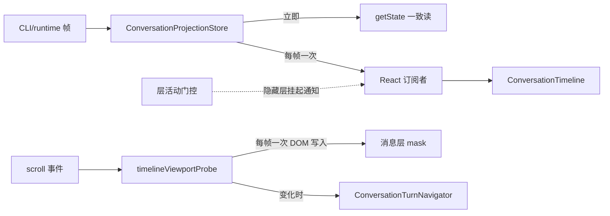

# 界面切换与聊天滚动性能

## 目标与证据

2026-10-03 在本机 dev 构建（Vite + Edge headless）上复测现有基线：

| 场景（1258×622，5,797 行，20Hz 流式） |            中位数 |     P95 |
| ------------------------------------- | ----------------: | ------: |
| 滚动（导航 rail 关闭）                |           10.6 ms | 16.1 ms |
| 滚动（导航 rail 开启）                |           18.8 ms | 38.6 ms |
| 滚动 + 流式（rail 开启）              |           31.1 ms | 70.2 ms |
| 切回长会话（单次挂载任务）            | 250–490 ms 长任务 |       — |

归因结论（源码 + 采样证据）：

- 滚动路径每个 scroll 事件都会 `setTurnNavigatorViewport`，导致 `ConversationTimeline`（1,919 行）与 `ConversationTurnNavigator` 每帧全量重渲染；DOM 扫描与消息层 mask 写入也按事件而非按帧执行。
- 每个 scroll 事件还重复写入 `maskImage/maskPosition/maskSize`，即使取值未变。
- 投影 store 每个 delta 帧立即同步通知全部 React 订阅者；一次流式 burst 内多帧通知会触发多次整树渲染。
- 设置页覆盖工作区、主视图在 chat / automations / plugin-store 之间切换时，底层界面要么持续重渲染要么整树卸载重建。
- 轮尾复制文本、工作项渲染项等按整轮规模在每次渲染/挂载时物化。

本轮从数据流与渲染边界重构，不改变协议、admission、owner/lease、scroll 恢复语义与视觉规则。

## 所有权与边界

- 会话事实仍由 CLI/runtime 与 `ConversationProjectionStore` 持有；本轮只改「通知节奏」与「谁订阅什么」，不改归约规则、帧顺序校验、snapshot/delta 语义。
- store 的通知合并是唯一机制：`getState()` 始终返回最新状态，延迟只作用于 React 通知；`document.hidden` 期间的挂起语义保持不变。
- 滚动驱动 UI（导航 rail、消息遮罩）改为按帧读取视口度量，`ConversationTimeline` 自身不再因滚动重渲染。
- 导航 rail 的度量源只有一个（`timelineViewportProbe`）；不再保留 `virtualizer.scrollOffset ?? state` 双读路径。
- 层活动门控只决定「隐藏层是否接收 React 通知」；隐藏层的 DOM、布局、store 订阅与恢复链路全部保留。
- 隐藏层不卸载、不改 `display`，避免动态测高在隐藏期间归零。

## 规则

1. 投影与本轮会话索引的通知按动画帧合并；无 `requestAnimationFrame` 的环境（Node 测试）保持同步通知。
2. 同一个动画帧内多次状态变更只通知一次；通知时刻读取的是最新状态。
3. 滚动事件只登记意图与度量失效，不触发 React 状态写入；`ConversationTimeline` 的渲染只由行数据、虚拟窗口与布局变化驱动。
4. 消息层遮罩按帧写入且取值不变时不写 DOM。
5. 导航 rail 关闭（`hideTurnNavigator`）、容器宽度不足 864px 或可导航 query 少于 2 条时，不做 DOM 扫描。
6. 主视图（chat / automations / plugin-store）首次访问后保持挂载；非活动层不接收 React 通知，恢复时一次渲染读到最新状态。
7. 设置页覆盖工作区时，工作区层进入非活动状态，不再随流式输出重渲染；关闭设置后一次渲染补回。
8. 派生缓存（渲染单元物化、行高）跨组件实例按会话作用域复用，键包含 session 与 logEpoch；LRU 有界。

## 验收

1. 同一帧内 20 次投影更新只产生一次 React 通知；隐藏文档期间不通知，恢复时通知一次且读到最新状态。
2. rail 开启时滚动帧分布改善（同机同数据对照），且 rail 活动指示、跳转、mask 视觉与行为不变。
3. 关闭 rail 的滚动不产生 React 状态更新（可用 `data-*`/性能采样断言）。
4. 主视图切换后返回聊天不出现整树重建、不丢失滚动位置与虚拟窗口。
5. 设置页开关后聊天区保持原状态（草稿、滚动位置、展开态）。
6. 会话切换、补页、rewind、反馈、查找等既有行为不回归；`pnpm typecheck`、`pnpm lint`、`pnpm architecture:check --changed` 通过并如实报告基线失败。
7. 浏览器 fixture 复跑：`measureScrolling`、`verifyInteractions`、`verifyWorkWindow`、`verifySessionSwitch` 通过，记录前后帧分布。

不迁移数据；不新增持久化；不改变 Desktop continuous 与 Web replayable 的恢复语义。
