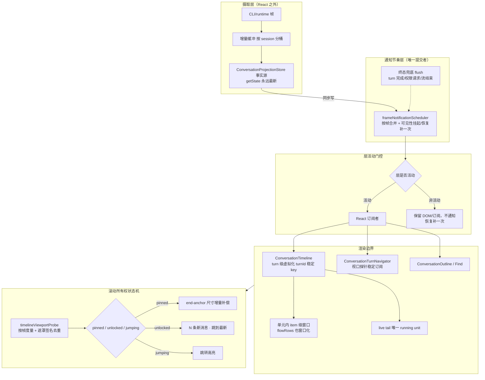

# 长会话体验 · 前沿深度设计

> 2026-10-03 竞品研究 + ZCode 落地对照。
>
> 本文回答一个问题：同类 AI 编程 Agent / 聊天工作台在「超长会话、持续流式、多视图切换、时间线导航、会话管理」上做到的最前沿设计是什么，ZCode 当前处在什么位置，下一步最该补什么。
>
> 证据等级：**[确认]** 官方文档 / 规范 / 源码 / 发布说明；**[报道]** 权威媒体或可信第三方；**[推断]** 多来源综合外推；**[未验证]** 仅单一弱来源。

## 0. 结论速览

1. **ZCode 的渲染性能路线已经对齐前沿，不需要推翻重做。** 帧合并通知、层活动门控、视口探针、turnId 稳定 key 行高缓存、live tail 拆分这五件事，在竞品里都是 2025–2026 才收敛出来的做法，ZCode 已经实现（见 §3）。
2. **真正的差距不在「通知节奏」，而在「单元内 item 级窗口」与「滚动所有权状态机」。** 竞品最惨的两个翻车点是：turn 级虚拟化撑不住单轮数百条 item（Codex VS Code 扩展，DOM 节点 3,903 → 773），以及贴底逻辑与虚拟化测量互相打架（assistant-ui 明确点名）。前者 ZCode 只做了一半，后者尚未成体系。
3. **导航与会话内查找上 ZCode 领先。** 单对话内的查找 + 高亮 + 跳转在 2026 年仍是市场空白（Cursor 的 in-chat Ctrl-F 还是 feature request），ZCode 已有 `useConversationTimelineFind`、outline、turn navigator。
4. **会话管理模式上 ZCode 落后**：缺 fork/branch、缺 summarize-from-here、缺 session picker 的范围三档与 PR 反查、缺 chronicle 式「问历史」。已有 rewind / storage preview / 归档 / 置顶 / 未读，底子在。
5. **一个依赖硬缺口**：`@tanstack/react-virtual` 当前锁在 `3.13.23`，**不含** 2026-05 才发布的聊天专用 API（`anchorTo:'end'` / `followOnAppend` / `scrollEndThreshold` / `useCachedMeasurements` / `takeSnapshot`），只有旧版 `initialMeasurementsCache`。端锚定与「隐藏测量」目前得自研或升级。
6. **一个可维护性红旗**：`ConversationRowView.tsx` 2,093 行，`ConversationTurnGroup.tsx` 1,314 行，`ConversationTimeline.tsx` 1,911 行，均已越过强复查线。

## 1. 研究范围

调研对象（2024–2026）：Claude Code、Cursor、Cline、Roo Code、Kilo Code、Windsurf、OpenAI Codex CLI（含 VS Code 扩展）、GitHub Copilot、Continue、Aider、OpenCode / Crush、Zed、Warp、Trae、Devin、ChatGPT、Claude.ai、Perplexity、Linear、Notion AI；以及 React 生态（TanStack Virtual、Virtuoso、react-window、Legend List、FlashList、Virtua、Assistant UI、shadcn MessageScroller、Streamdown、use-stick-to-bottom）、W3C/CSSWG 规范、Chrome/WebKit 团队文章。

只采用联网检索到的一手材料，来源 URL 见 §7。

## 2. 竞品全景：谁做对了，谁翻车了

| 产品                | 长会话渲染                                                                                                             | 关键证据                                       | 可信度    |
| ------------------- | ---------------------------------------------------------------------------------------------------------------------- | ---------------------------------------------- | --------- |
| Claude Code (CLI)   | alternate screen buffer + 差分渲染，只渲染可见消息，内存恒定；scene graph → ANSI 约 5ms / 16ms 帧预算                  | 官方 Fullscreen 文档；TUI 工程师 HN 回复       | 确认      |
| Codex CLI           | Rust + ratatui 重写，自管滚动不依赖 scrollback                                                                         | HN「Codex CLI is going native」                | 确认      |
| Codex VS Code 扩展  | 4 类扩展性缺陷：子代理父历史重复扫描、**turn 级虚拟化不约束 DOM**、快照冲刷过频、ResizeObserver 回调同步测量           | OpenAI 社区长篇技术报告                        | 报道      |
| Devin               | 重写渲染器：经典虚拟化 + 骨架「地图」+ island 懒加载 + anchor row 防抖动 + islet 补齐；加载快 70%、layout shift 降 86% | 官方工程文章                                   | 确认      |
| Roo Code            | react-virtuoso + 「只留最近 500 条」切片 → 索引位移，流式时视口跳到会话中部                                            | issue #7052 附源码行号                         | 确认      |
| Cline               | 主扩展按逻辑块分组增量渲染；Kanban 面板未虚拟化，长会话不可用                                                          | kanban issue #515                              | 确认      |
| Cursor              | 长 Agent 会话不做虚拟化，renderer RSS 涨到 ~2GB                                                                        | 论坛实测帖                                     | 报道      |
| GitHub Copilot Chat | 未虚拟化，长会话卡顿；issue 仍 Open/stale                                                                              | vscode issue #316407                           | 确认      |
| ChatGPT / Claude.ai | 长会话整体保留 DOM，无原生虚拟化，卡顿普遍                                                                             | 社区 + issue #24146（被 Close as not planned） | 报道      |
| Zed                 | Rust + GPUI，懒渲染后 10k 条目 5FPS → 120FPS                                                                           | 社区实测 + 官方 FPS 博客                       | 报道/确认 |
| Warp                | Rust + GPU 自绘，整体渲染但红绘 ~1.9ms、>144FPS                                                                        | 官方工程博客（2021 数字）                      | 确认      |

**共性结论**：DOM 客户端的默认答案是虚拟化；终端是「免费虚拟化」；GPU 自绘是另一条路（整体渲染 + 极高刷新率）；上下文压缩（compact/summary）解决的是 token/记忆，**不是** DOM 规模，两者常被混淆。

## 3. ZCode 现状对照（代码证据）

### 3.1 已落地且对齐前沿

| 能力                                                | ZCode 实现                                                                                                                              | 竞品对应                                                                                            | 判断     |
| --------------------------------------------------- | --------------------------------------------------------------------------------------------------------------------------------------- | --------------------------------------------------------------------------------------------------- | -------- |
| 帧内通知合并                                        | `lib/frameNotificationScheduler.ts`：状态同步写、通知按 rAF 合并、`visibilitychange` 隐藏挂起 / 恢复补一次、无 rAF 环境退化同步         | 与 Codex「有界合并 + 语义 flush」同源，且更完整（含可见性）                                         | **领先** |
| 层活动门控                                          | `lib/layerActivity.tsx`：`LayerSurface` 非活动层保留 DOM/布局，用 `invisible absolute inset-0` + `inert`，不接收 React 通知，恢复补一次 | React `<Activity>` 用 `display:none` 会归零测高；ZCode 选保布局的 `visibility` 路线，正是社区推荐解 | **领先** |
| 视口探针                                            | `v4/timelineViewportProbe.ts`：滚动只登记失效、按帧合并、遮罩按签名去重写 DOM、稳定 selector 订阅、导航 rail 是唯一度量消费者           | 对应 shadcn MessageScroller 的「滚动热路径不触发 React rerender，状态镜像到 data-\*」               | **领先** |
| turn 稳定 key                                       | `ConversationTimeline` 的 `getItemKey` 用 render unit 的 turnId                                                                         | 对应 TanStack「必须稳定 key」、Roo 翻车的反面教材                                                   | **正确** |
| 行高缓存跨实例                                      | `v4/timelineRowHeightCache.ts`：以 turnId 为键、LRU 有界 4000、会话切换 clear                                                           | 对应 TanStack `initialMeasurementsCache` 的持久化思路                                               | **领先** |
| live tail 拆分                                      | `v4/conversationTimelineLiveTail.ts`：只把最后一个 running unit 拆成 normal-flow，避免流式与虚拟化测量互相打架                          | 对应 assistant-ui「自定义 scrollToFn 抑制 virtualizer 回写」的同类问题                              | **正确** |
| 会话内查找                                          | `v4/useConversationTimelineFind.ts`                                                                                                     | 2026 年仍是市场空白                                                                                 | **领先** |
| outline / turn navigator                            | `ConversationOutline` + `conversationOutlineModel`（搜索、`#数字`跳转、渐进加载）；`ConversationTurnNavigator`                          | 多数竞品只有 checkpoint 列表或第三方 minimap                                                        | **领先** |
| 会话索引 / 存储预览 / 永久删除 / 归档 / 置顶 / 未读 | `sessionsIndexStore`、`TaskStorageDialog`、`taskList.pin/archive`、`unreadAt` join                                                      | 对齐 VS Code Sessions list 的一部分                                                                 | **持平** |

### 3.2 真实差距

**D1 · 单轮 item 级窗口（渲染边界）**
`ConversationTimeline` 在 **render unit（回合）粒度**虚拟化。`conversationTurnRenderUnits` 单元内只做了 `flowRows` / `tailRows` 的尾部拆分，`flowRows` 仍是整段挂载。Codex 报告的直接证据表明：turn 级虚拟化在「单轮含数百条归一化 item」时不约束 DOM（活动尾部挂载 17 turns / 3,903 节点 → item 级 200 条窗口后 4 turns / 773 节点）。ZCode 的巨型回合（长工具链、长 subagent 输出）会命中同一问题。

**D2 · 滚动所有权状态机**
目前贴底判定散落在 `timelineScrollAnchor.ts` + `isAtBottom`，live tail 与虚拟化测量已有仲裁，但没有统一的 `pinned / unlocked / jumping` 三态机，也没有「N 条新消息 · 跳到最新」的持续可见入口与「选中文本 / 键盘 / 拖滚动条即解锁」的完整解锁信号集。

**D3 · 端锚定与 prepend 保持视口**
`@tanstack/react-virtual@3.13.23` 无 `anchorTo:'end'` / `followOnAppend` / `scrollEndThreshold`（已核实 node_modules 中不存在）→ 流式贴底的尺寸增量补偿、向上加载历史时保持视口，都得自研或升级库。

**D4 · 会话内新消息标记 / 未读位置线**
有列表级 `unreadAt`，未见会话内的「新消息分隔线」（Slack/Discord 模式）。

**D5 · 会话管理模式**
缺 fork/branch（Claude Code `/branch`、Copilot `/fork`、ChatGPT branch in new chat）；缺 summarize-from-here/up-to-here（Claude Code、Zed New From Summary）；缺 session picker 的「项目 / worktree / 全机器」范围三档与按 PR 反查（Claude Code）；缺 chronicle 式「自然语言问历史」（Copilot `/chronicle`，ZCode 有 sessions-index 数据基础）。

**D6 · 可维护性**
`ConversationRowView.tsx` 2,093 行、`ConversationTimeline.tsx` 1,911 行、`ConversationTurnGroup.tsx` 1,314 行、`conversationProjectionStore.ts` 1,375 行。均已越过 800 行强复查线，是本模块最大的长期风险。

## 4. 前沿做法逐维度深挖

### 4.1 虚拟化与身份

- **稳定 id key，禁止 index 身份**。Roo #7052 的根因就是「保留最近 500 条」按 index 追踪 + 数组位移。ZCode 已正确用 turnId，且 `slice` 均为描述性切分而非数据截断（无该 bug）。
- **视口 + buffer 窗口**：react-virtuoso 用 `increaseViewportBy {top:3000,bottom:1000}`。TanStack 用 `overscan`。
- **数据全量留 store、只窗口化渲染**：Codex 明确「complete data in client state, derive a render-only window」。
- **item 级窗口，不只 turn 级**：Codex 报告的 Finding 2。
- **骨架「地图」+ island 懒加载**（Devin）：只查事件 `type` 画等高骨架，滚到未加载区再拉完整事件。适用于「历史超长、首屏要秒开、能滚到任意位置」的场景；ZCode 已有 `timelineViewportProbe` 度量基础，但要先有分页加载能力。

### 4.2 流式渲染隔离

- **块 = 最小更新单元，只有最后一块是活的**（Textual 优化，官方称 equally applicable in the browser）：Markdown 按顶层 block（段落/代码围栏/表格/标题）切分，finalized 后缓存永不重建；只解析最后一个 block（解析成本与文档总长解耦）。
- **生产/消费缓冲**：token 到达快于渲染时拼接 buffer，用最新整块替换。
- **只有正在流式的行订阅易变切片**：Jotai `splitAtom` / Valtio 属性级订阅对标；Zustand 需手工做 `streamingTextById` 分片。
- **有界合并 + 语义 flush barrier**：Codex 建议合并到 200ms，并在 turn 完成 / 权限请求 / 用户输入处强制 flush。ZCode 的帧合并已覆盖「按帧」，但**跨 macrotask 的终态**要确认有兜底（当前靠可见性事件，隐藏期间流结束的终态可能滞后到恢复才提交）。
- **每 chunk 全量 parse Markdown 再 innerHTML 是 O(n²) 反模式**（Chrome 官方）。

### 4.3 滚动锚定与贴底

- **原生 `overflow-anchor` 救不了聊天**：只补偿视口上方变化；虚拟列用 `transform` 定位会命中规范的 suppression trigger；Safari 直到 27.0（2026-09-17）才支持。→ 必须自研锚定。
- **规则**：只在用户本来贴底时跟随；上滑 / 选中文本 / 键盘 / 拖滚动条 / 开链接 / 搜索一律停止跟随（shadcn MessageScroller 列了 14 条流式聊天行为）。
- **Anchor row 补偿**（Devin）：取「最上面可见的已加载行」（无则取最上面骨架），记录顶边相对视口位置，layout 后在 paint 前补偿 scroll offset。
- **打开历史默认落在最后一个有意义回合**（last-anchor），而非绝对底部。
- **流式中用户在读历史**：只「武装」返回最新策略，等**下一条新消息**才重新启用（Codex Finding 2 规则 8）。
- **不要在主线程 ResizeObserver 回调里同步 setState**（Codex Finding 4）；按帧批处理、每行只留最新测量。

### 4.4 界面切换与隐藏层测量

- React 19.2 `<Activity mode="hidden">` 已稳定：`display:none`、销毁 Effects（订阅随之退订）、隐藏期间低优先级重渲染、恢复时重建。代价：`display:none` 会让 ResizeObserver 报 0×0 → 虚拟列表测量归零。
- **保布局的隐藏**（`visibility:hidden` / 绝对定位叠放）可让测量不归零——这正是 ZCode `LayerSurface` 的选择，代价是隐藏层仍参与布局。ZCode 用 `absolute inset-0` 让隐藏层脱离流叠加，是合理折中。
- keep-alive 库结论：`react-activation` 禁 StrictMode、不支持 React 19（issue #337）、破坏 Context/ref 顺序 → **不要用**；`keepalive-for-react` 维护活跃但引入包体与淘汰语义。ZCode 自研 `LayerSurface` 是更可控的路径。
- 隐藏层的工程细节：焦点 `inert`（已有）、IME composition 需 `blur` 清理（**待验证，中文输入必测**）、滚动位置显式保存/恢复、媒体用 `useLayoutEffect` cleanup。

### 4.5 时间线导航

- 抽象应是 **turn/anchor 而非 message index**：`currentAnchorId`（滚出上方仍保持）+ `visibleMessageIds`，供 outline 高亮与跳转。
- minimap 首选 **HTML/SVG marker 轨道**（每回合一点），位置映射优先「按 index 等距 / 按估算偏移 + 持久尺寸缓存」逐步收敛，避免 estimate 抖动导致 minimap 跳。
- 真实产品：ChatGPT 曾有右侧 TOC（2026-08 被报回归消失）；VS Code minimap + overview ruler；Slack/Discord 未读分隔线 + jump to present；Figma Layers Panel 两遍计算（先算有序 rowId，再只算窗口内属性，rope 结构避免 O(n²)）。

### 4.6 会话管理

- **checkpoint 三语义成为标配**：只回代码 / 只回对话 / 都回（Claude Code、Cline、Cursor、Windsurf、Zed 全部收敛到同一范式）。回退后把原 prompt 回填输入框。
- **rewind 与 branch 分离**：rewind 是回到过去，branch 是保留过去另开一条；UI 要标明「当前在哪个分支」。
- **Summarize 一等公民**：可指定方向（from here / up to here）、可引导（focus）、可见 marker。
- **会话列表升级为任务中心**：pin / archive / mark done / delete / 自定义分组 / 未读与进行中 badge / 应用图标计数。
- **多 Agent 编排视图** 是 2025 最大变化：每个 agent 独立上下文窗、worktree 隔离、subagent 嵌套只读展示、tab/网格并排。
- **会话历史变成可检索数据层**：Copilot `/chronicle`（本地 SQLite + 自然语言问历史 + standup/成本报告 + `improve` 反哺 instructions）。
- **跨设备连续性**：Claude Code Remote Control（手机接管本机会话、多端同步 subagent/workflow 状态、断线重连）；VS Code 的「外部会话发现 + 单写者锁」。

## 5. 最极致深度设计

### 5.1 目标架构

### 5.2 分阶段路线图

**P0 · 保持既有优势（不动）**
帧合并通知、层活动门控、视口探针、turnId 稳定 key、行高缓存、live tail 拆分。这六件是竞品 2025–2026 才收敛的成果，ZCode 已实现，不推翻。

**P1 · 渲染边界补全（对应 D1、D6）**

1. `flowRows` 也做 item 级窗口：超过阈值（如单轮 200 条）时只挂载视口 ± buffer，其余用等高占位。依据 Codex Finding 2。
2. 流式隔离确认与加固：Markdown block 级 memo（只有最后一块重渲染）、确认只有 running 行订阅易变切片、确认跨 macrotask 终态 flush 兜底。
3. 拆分 `ConversationRowView` / `ConversationTimeline` / `ConversationTurnGroup`：按「行数据派生 / 行渲染 / 交互」拆，为 P1.1 的窗口化腾出可测试边界。不追求凑行数。

**P2 · 滚动所有权状态机（对应 D2、D3）**

1. 引入显式三态 `pinned / unlocked / jumping`，单一所有者（`timelineScrollAnchor` 扩展）。
2. 解锁信号集：上滑、选中文本、键盘导航、拖滚动条、跳转历史。锁定恢复：滚到底或点按钮。
3. 端锚定：先评估升级 `@tanstack/react-virtual` 到含 `anchorTo:'end'` 的版本；不可行则在 `timelineScrollAnchor` 自研「贴底时按尺寸增量补偿 scrollTop」。
4. 「N 条新消息 · 跳到最新」浮动入口 + 计数。
5. prepend 历史保持视口（`maintainVisibleContentPosition` 等价）：靠稳定 key + anchor row 快照。

**P3 · 导航增强（对应 D4）**

1. 会话内「新消息分隔线」（未读位置线），复用现有 `unreadAt`。
2. outline 与 rail 联动：outline 点击 → 高亮当前回合 + 跳转；rail 活动项复用探针（已具备）。
3. 打开历史默认 last-anchor。

**P4 · 会话管理模式（对应 D5）**

1. fork / branch：从任意回合或 checkpoint 另开一条，继承到该点，原任务保留；UI 标明所在分支。
2. rewind 三语义核对与补齐（只代码 / 只对话 / 都回），回退后 prompt 回填。
3. summarize-from-here / up-to-here，压缩 marker 可见。
4. session picker 范围三档（项目 / worktree / 全机器）+ PR 反查。
5. chronicle 式「问历史」：基于现有 sessions-index 数据层，先做 search，再考虑自然语言。

**P5 · 验证与观测（贯穿）**
自建「虚拟化 debugger」：可视化虚拟窗口 / anchor / 测量，记录每次滚动 / 加载 / 流式动作（Devin 方法）。指标：滚动帧分布、scrollTop 漂移、活动挂载 DOM 节点数与回合数、输入延迟 p95、切回长会话长任务时长。区分 median 与 p95。

### 5.3 优先级与理由

| 顺位 | 事项                        | 理由                                                                     | 证据强度 |
| ---- | --------------------------- | ------------------------------------------------------------------------ | -------- |
| 1    | 单轮 item 级窗口            | 唯一被公开报告证实的「turn 级虚拟化撑不住」缺陷，且 ZCode 已具备一半机制 | 确认     |
| 2    | 滚动所有权状态机 + 端锚定   | 竞品共同痛点，也是用户体感最强的部分；依赖库缺口需先决策                 | 确认     |
| 3    | 流式隔离确认                | 决定长回复越写越卡与否                                                   | 确认     |
| 4    | 会话内未读线 + outline 联动 | 成本低、体感明显、ZCode 有基础                                           | 确认     |
| 5    | fork/branch + summarize     | 会话管理代差，工作量大                                                   | 确认     |
| 6    | 行文件拆分                  | 长期风险，配合 P1/P2 一起做                                              | 推断     |

## 6. 风险与验证

### 6.1 风险

1. **库版本决策**：升级 `@tanstack/react-virtual` 可能引入行为变化（已知 issue #1133 删除项后 stale data-index 导致测量丢失）。锁定版本 + 专项回归。
2. **`LayerSurface` 的 `absolute inset-0`**：隐藏层脱离流叠加，需确认外层容器始终有高度，否则隐藏层内滚动容器高度来源不稳。**待验证**。
3. **IME 与隐藏层**：`display:none` / `invisible` 切换可能中断中文 composition。**待验证，中文必测**。
4. **跨设备恢复**：滚动位置目前是本机 `timelineScrollAnchor`；手机远控 `web-remote-replayable` 是否需要等价恢复需单独确认。
5. **隐藏期间流结束的终态**：当前靠 `visibilitychange` 补一次；若隐藏期间流结束，终态要等恢复才提交。需确认是否有低频兜底。
6. **item 级窗口的正确性**：窗口化后 find-in-conversation / 复制 / 无障碍会受影响（assistant-ui 与 shadcn 都特意保留真实 DOM 行来支持 find-in-page）。需明确「窗口化 vs 查找」的取舍：ZCode 已有会话内查找，窗口化不能破坏它。

### 6.2 验证计划

沿用 `specs/conversation/interface-switch-and-scroll-performance.md` 的验收项，扩展以下组合场景：

- 单轮含 500+ item：滚动帧分布、活动挂载节点数（对照 Codex 的 3,903 → 773 量级）。
- 流式增长中向上阅读：不被拽回；「N 条新消息」计数正确。
- 顶部 prepend 历史：视口不漂移（同一 anchor 的视觉位置变化）。
- 切 tab / 开设置页再返回：DOM 不重建、滚动位置与虚拟窗口保留、草稿保留。
- 隐藏期间流结束，恢复后一次渲染读到终态。
- 中文 IME 在隐藏层切换时的 composition 行为。
- 会话内查找在窗口化后仍能命中未挂载区域（或明确标注为「需先加载」）。

## 7. 关键来源（精选）

**规范与官方文档**

- CSS Scroll Anchoring L1（W3C TR，2020-11-11）https://www.w3.org/TR/css-scroll-anchoring-1/
- WebKit Safari 27.0 支持 Scroll Anchoring（2026-09-17）https://webkit.org/blog/18325/webkit-features-for-safari-27-0/
- web.dev content-visibility（2020-08，更新 2025-09）https://web.dev/articles/content-visibility
- React 19.2 发布与 `<Activity>` https://react.dev/blog/2025/10/01/react-19-2 ；https://react.dev/reference/react/Activity
- Chrome 流式 LLM 响应渲染最佳实践（2025-01-21）https://developer.chrome.com/docs/ai/render-llm-responses
- MDN Scheduler.yield https://developer.mozilla.org/en-US/docs/Web/API/Scheduler/yield
- W3C requestIdleCallback（隐藏节流）https://w3c.github.io/requestidlecallback/

**库**

- TanStack Virtual 聊天博客（2026-05-25）https://tanstack.com/blog/tanstack-virtual-chat
- TanStack Virtual 性能与 iOS（2026-05-19）https://tanstack.com/blog/tanstack-virtual-perf-and-ios
- TanStack Virtualizer API（useCachedMeasurements / takeSnapshot）https://tanstack.com/virtual/latest/docs/api/virtualizer
- shadcn MessageScroller https://ui.shadcn.com/docs/components/aria/message-scroller
- assistant-ui Thread Virtualization https://www.assistant-ui.com/docs/guides/virtualization
- Streamdown memoization https://streamdown.ai/docs/memoization
- use-stick-to-bottom https://github.com/stackblitz-labs/use-stick-to-bottom
- Virtua（对比表 + iOS 坑）https://github.com/inokawa/virtua
- Legend List v3 https://legendapp.com/open-source/list/v3/overview/
- FlashList v2 工程博客（2025-07-31）https://shopify.engineering/flashlist-v2

**产品与工程文章**

- Devin 重写渲染器（官方工程文章）https://x.com/DarraghBurke_/article/2092644203733909712
- Codex VS Code 扩展性能报告 https://community.openai.com/t/codex-vs-code-webview-becomes-progressively-unresponsive-during-long-running-conversations/1388504
- Claude Code fullscreen rendering https://code.claude.com/docs/en/fullscreen
- Claude Code checkpointing / sessions / remote-control https://code.claude.com/docs/en/checkpointing
- Roo Code issue #7052 https://github.com/RooCodeInc/Roo-Code/issues/7052
- vscode issue #316407 https://github.com/microsoft/vscode/issues/316407
- VS Code Sessions list https://code.visualstudio.com/docs/agents/run/sessions/manage-sessions
- Copilot CLI chronicle https://docs.github.com/en/copilot/how-tos/copilot-cli/use-copilot-cli/chronicle
- Figma Layers Panel 工程博客（2026-06-11）https://www.figma.com/blog/improving-performance-in-the-layers-panel/
- Cursor 论坛：长会话 renderer 内存 https://forum.cursor.com/t/long-agent-chats-keep-full-history-in-renderer-need-lazy-virtualized-message-list-linux-agents-window/168073

**React / store 语义**

- reactwg #86（uSES 契约、startTransition 对外部 store 无效、useDeferredValue 可切片）https://github.com/reactwg/react-18/discussions/86
- react-redux #2086 https://github.com/reduxjs/react-redux/issues/2086
- Zustand 比较文档 https://zustand.docs.pmnd.rs/learn/getting-started/comparison.html
- Jotai 性能指南 https://jotai.org/docs/guides/performance
- Vercel AI SDK issue #18547（v8 默认 50ms 发布节奏）https://github.com/vercel/ai/issues/18547

## 8. 已确认 / 推断 / 未验证

**已确认**

- ZCode 已实现帧合并通知、层活动门控、视口探针、turnId 稳定 key、行高缓存、live tail 拆分（源码核查）。
- `@tanstack/react-virtual` 锁定 3.13.23，不含 anchorTo / followOnAppend / scrollEndThreshold / useCachedMeasurements / takeSnapshot（node_modules 核查）。
- 竞品证据：Codex 4 类缺陷、Devin 70%/86%、Roo #7052、Claude Code fullscreen、shadcn MessageScroller 策略、Activity 语义、TanStack 聊天 API 时间线、Safari 27 锚定、content-visibility、uSES 契约。
- ZCode 文件规模（wc -l 核查）。

**推断**

- 「单轮 item 级窗口」是 ZCode 最可能的性能缺口（基于 Codex 证据 + 代码结构，未实测）。
- item 级窗口与会话内查找的取舍风险。
- 行文件拆分的具体边界。
- 会话管理模式差距的优先级排序。

**未验证**

- ZCode 巨型回合的实际 DOM 节点数与滚动帧分布（需跑 Playwright fixture）。
- `LayerSurface` 隐藏层内滚动容器的高度来源是否稳定。
- 中文 IME 在层切换时的 composition 行为。
- 跨设备（手机远控）滚动恢复是否已有等价实现。
- 隐藏期间流结束的终态提交时延。
- 竞品中 Cursor 3 / Trae / Notion 的部分细节来自第三方，未取官方原文。

## 9. 与现有 spec 的关系

本文是**研究 + 目标设计**，不是实现契约。落地的行为契约仍写在各功能 spec：滚动与切换性能见 `specs/conversation/interface-switch-and-scroll-performance.md`；`fork/branch`、`summarize`、`未读线` 等新行为在实现前各自补 spec（明确产品规则、状态所有者、接口与验收场景），不在本文直接约束代码。
