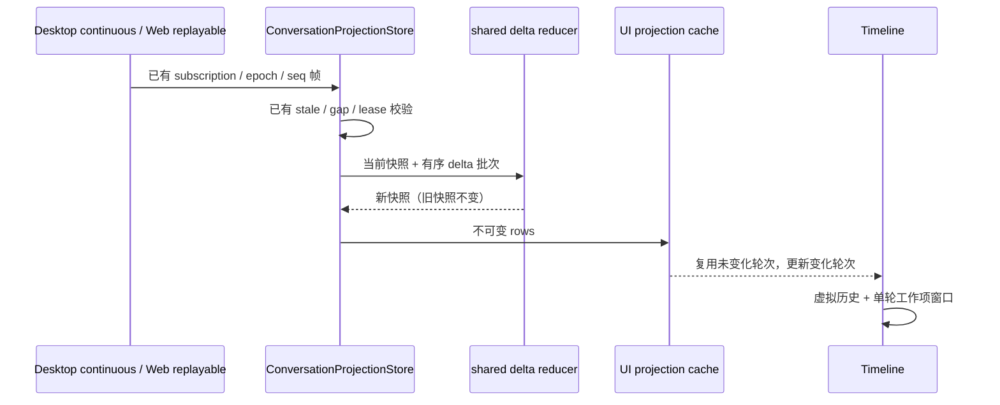

# 长会话渲染与增量更新

## 产品规则

- Desktop 与手机 Web 保持同一消息顺序、压缩标记、工具结果、搜索、复制和展开行为。
- 历史长度增加不能导致每条流式事件重新转换全部工具输入或重新物化全部历史轮次。
- 一帧内多条 delta 只复制一次消息窗口；空批次和纯状态更新不复制消息窗口。
- 搜索为空时不解析正文；历史补页、同 ID 内容替换、分支裁剪和切换会话必须使对应搜索缓存失效。
- 长工作列表按视口挂载，选择、焦点和查找命中项暂缓回收；工具展开状态沿用已有持久化路径。当前窗口契约见 [桌面性能迭代](desktop-performance-iteration.md)。
- 不通过截断消息、丢弃流式事件或强制折叠历史换取性能。

## 所有者与接口

- CLI/runtime 仍拥有业务事实；ConversationProjectionStore 仍拥有客户端快照与序号校验。
- shared 的 applyConversationDeltas 负责帧内归约，结果与逐条 applyConversationDelta 深度相等，旧快照不可被修改。
- UI 的 render-unit cache 仅保存派生投影，按组件实例与 session/logEpoch 隔离；仅保留当前窗口中的轮次。
- render-unit cache 以行对象引用、轮次位置与生命周期为有效性条件，不假定已完成消息永远不变。
- 工具适配缓存使用 WeakMap，键是不可变 row 对象，随快照释放；不保存第二份业务状态。
- 搜索缓存以 render-unit 对象为键，查询或投影设置变化时整体替换。
- 原有 turn、guide、CUA、工具聚合规则仍是唯一物化路径。

不改变 admission、owner/lease、网络协议、重连或持久化。失败语义沿用原契约，不增加定时重试或吞错分支。

## 验收

1. 大窗口混合 append/upsert/text delta/remove/state 批次与规范单条 reducer 等价；旧快照深冻结后仍可应用。
2. 尾部流式变化时历史 render-unit 引用不变；计时、补页、隐藏轮次、同 ID 替换、裁剪和 phase 变化正确更新。
3. 重复读取同一 tool row 不重复解析；新 row 对象的内容和状态正常刷新。
4. 空搜索不读取正文；补页、同 key 新内容、语言查询变化不会命中旧缓存。
5. 浏览器合成长会话覆盖滚动到早期/底部、展开历史、持续流式输出、搜索和窄屏；记录实际结果与局限。
6. 用固定合成数据报告批处理及投影缓存性能；耗时仅作本机观测，不作为跨机器脆弱断言。

## 边界

初次加载仍需 O(N) 建立投影，当前改变轮次仍需重算其内容。虚拟窗口限制挂载成本，但不限制原始消息模型大小；单条超长 Markdown 不在工作项之间进一步拆分。全项目其他界面和所有操作系统的性能需要独立场景验证，不能由本场景推断。
