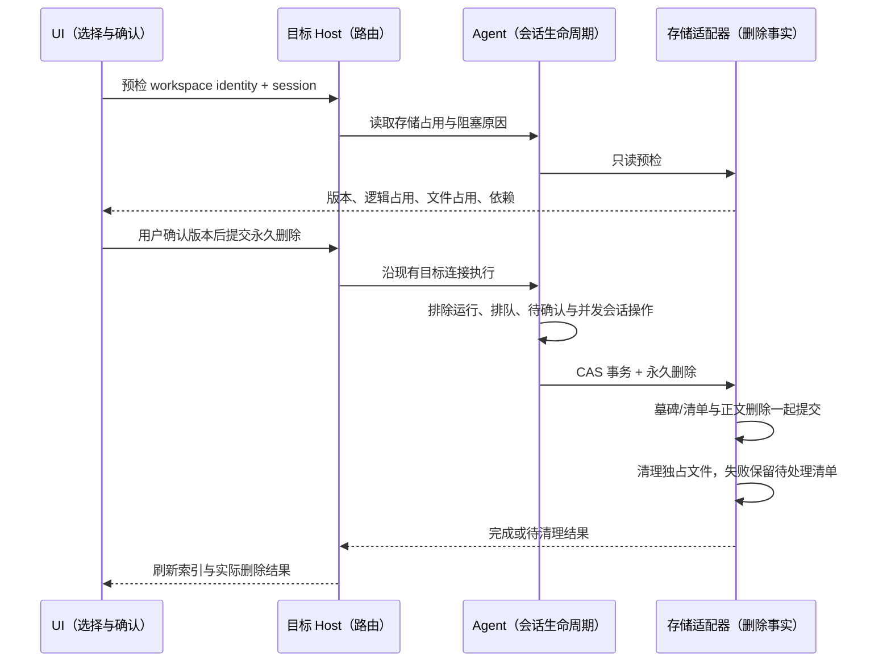

# 会话存储预检与永久删除

## 产品语义

- 现有归档、列表删除与 `deleteSession`（关闭运行时）语义保持不变。新增独立的永久删除入口，确认前展示会话正文逻辑字节、记录数、可清理的会话专属文件字节及阻塞原因。
- 只处理用户明确选择的会话；不级联删除其他会话、分支、工作区源文件、导出文件或备份。其他会话依赖目标时先阻止永久删除，提示先处理依赖。
- 永久删除由目标 Agent 的存储端口执行，UI 不访问数据库或文件系统。Host 按原 workspace identity / remote session 路由；请求显式携带工作区身份与会话 ID，存储事务再次验证归属。
- 删除以预检版本为 CAS 条件，执行时再次检查依赖、待执行输入和运行状态。运行中的任务不得被自动停止或强删。
- 数据库删除和文件删除分阶段：先持久化清理记录并原子删除正文及关联行，再清理明确归属的应用内部文件；文件失败保留待清理清单，同一会话可重试。重启后结果不能伪装成从未删除。
- 保留最小删除墓碑以阻止旧进程重新写入同一会话 ID，不保留正文。共享资源或无法可靠确定归属的文件必须保留并明确报告，不计算成已回收。
- Host tasks-index 同步清空全文检索正文、标题与内容元数据，使用独立最小墓碑阻止迟到的索引回填；清理未完成时保留无正文的归档重试入口。CLI 提交后 Host 失败允许从 CLI 持久结果重试收尾，不尝试恢复已删除会话。
- Host 增加 additive `0004_task_storage_purge` 迁移，CLI 增加 `0023_session_purge`；失败时回滚本库事务。两个库不伪装成分布式事务，重试是收敛路径。回退应用版本时保留墓碑/触发器，不撤销已提交的用户删除。
- SQLite 逻辑删除释放的页可复用；逻辑字节不等于物理回收字节。数据库整理单独报告结果，不把每次删除都变成全库 VACUUM。
- 原有库的迁移为 additive：新增清理记录及防复活触发器；迁移原子提交，失败回滚。执行删除前先预检；验证只使用临时数据库和临时文件，不清理开发者真实历史。

## 所有者与事件顺序



Desktop continuous 与 Web replayable 的业务流顺序不变；永久删除结果不是可重放正文事件。远程失联不返回成功，重新连接后同目标重试读取持久结果。

## 验收

1. 临时 SQLite 中正文、parts、输入历史、使用量、目标、事件等关联记录在一个事务内删除；其他会话与工作区保持不变；失败回滚。
2. 运行中、排队中、依赖仍存在、工作区不匹配、预检版本过期均不删除。
3. 路径穿越、符号链接、junction、共享引用不越界删除；文件失败后可重试，重试不会重新删除新会话。
4. UI 展示清理范围、不可恢复提示与阻塞原因；确认后有进度、成功/部分失败反馈，旧异步结果不污染切换后的目标。
5. 根与 CLI 类型/lint、架构检查、受影响单测和浏览器交互实际执行，环境限制与历史失败单独记录。

## 交付与验证（2026-10-01）

入口为侧边栏「归档」列表每行的「存储与永久删除」按钮。占用统计只在打开弹窗时执行；长列表不会逐行查询数据库，也不逐行挂载弹窗。数据库统计是 CLI 会话记录序列化后的 UTF-8 估算值；文件统计只包含 `cli/sessions/<id>` 和 `cli/agents/<id>` 的常规独占文件。索引副本同步清除，但不额外计入这份占用估算。

共享附件、全局缓存、诊断日志、工作区文件、导出、导入原件和备份保留；有工作流/定时/闲时任务关联时阻止删除。不是全盘痕迹擦除，也不自动运行 VACUUM。空的专属目录可能保留。文件在提交后变化或暂时无权限时返回待清理，保留清单；旧副本或备份不会被作为成功回收计入。

验证结果：

- 隔离 SQLite/文件、运行时互斥、真实协议启动与分派、Host 索引去正文、远端来源换代共 11 项测试通过。真实协议测试不创建模型 runtime，不使用真实用户目录。
- 浏览器覆盖 1100px、390px、260px；确认前不可执行、重新预检/切换来源后确认失效、阻塞提示、部分失败重试、请求异常、关闭后迟到结果、中英文均通过。截图保存在忽略目录 `node_modules/.cache/session-purge-browser/`，已检查手机布局。
- 根 `pnpm typecheck` 通过；CLI `pnpm --dir apps/zcode-cli typecheck` 通过（27 个任务）。本机通过 Corepack 与临时 PATH 补齐 pnpm/turbo 入口，CLI 使用 Node 24.14.0。
- 根 `pnpm lint` 为 0 错误、63 个既有警告。CLI 全量 lint 未通过，包含已有 `max-lines` 等问题；本轮变更文件定向 lint 的 4 个超长文件错误和 2 个警告均在 HEAD 基线重现，新增文件无 lint 错误。没有放宽规则或添加忽略项。
- `pnpm architecture:check --changed` 为 0 violations / 0 baseline / 0 new；本轮文件分别使用根与 CLI 自带格式化器检查通过，`git diff --check` 通过。
- 本轮跨 CLI、shared、services/session、desktop/host、ui 边界接线，新增源码净 1,228 行（不计测试及 spec）；事务与文件清理在适配器内，Host 只路由/维护索引投影，UI 只持有确认与请求状态。

复现：

```powershell
node --import tsx --test apps/zcode-cli/packages/adapters/test/session-purge.test.ts apps/zcode-cli/packages/bootstrap/test/session-storage.test.ts apps/zcode-cli/packages/bootstrap/test/session-storage-integration.test.ts packages/services/test/taskStoragePurge.test.ts packages/desktop/test/taskStorageRouting.test.ts
corepack pnpm exec vite --config packages/ui/test/browser/vite.config.mjs
# 保持上述 Vite 服务运行，在另一个终端执行：
node packages/ui/test/browser/run-task-storage.mjs
```

远端断连/换代由真实 Host Controller 配合隔离服务验证；没有连接真实远端机器执行删除。未在 macOS/Linux 实机验证。开发过程中未删除或迁移真实历史数据。
