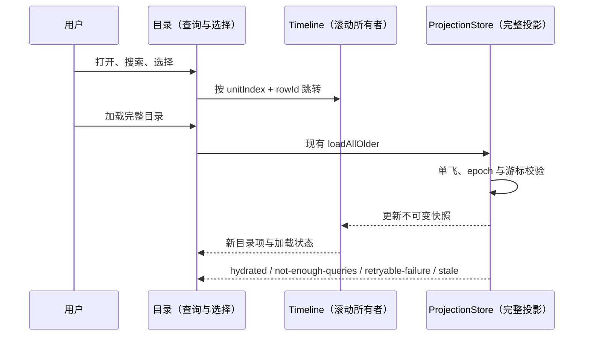

# 可搜索会话目录

## 产品规则与边界

- 在现有 Timeline 顶部提供「会话目录」入口，桌面、手机和窄分屏一致可达；分享选择时沿用 `hideTurnNavigator` 隐藏规则。原有桌面问题导航细条保留。
- 目录逐条显示真实用户问题、回答摘要、当前阅读位置和运行状态；沿用现有 navigator items，不把系统上下文当成问题。
- 搜索覆盖完整用户问题及已生成的回答摘要。空格分隔词要求全部命中、不区分大小写；`#数字` 精确定位当前已加载目录的序号。不会将摘要搜索标成助手全文搜索。
- 搜索、选中项、加载反馈归目录组件所有，只是 UI 局部状态。按稳定 item key 保留键盘选择，分页前插不改变选择身份。关闭目录释放搜索派生状态，切换 workspace/session/logEpoch 重挂载目录。
- 键盘上下选择、PageUp/PageDown 翻页、Ctrl/Meta+Home/End 首尾、Enter 跳转、Escape 关闭并恢复入口焦点；输入法组词不触发跳转。不注册全局快捷键，不抢占编辑器按键。
- 目录使用已有 TanStack Virtual，只挂载视口与选中项；搜索通过 deferred query 更新，普通聊天不构建搜索索引。适配主题、系统减少动画及窄屏输入字号。
- 跳转复用 Timeline `scrollToQuery`，按 rowId 精确定位同一 product turn 内的问题；不改变内容、重试、fork 或命令提交。
- 目录标明已加载数量。存在更早历史时显式提供「加载完整目录」，复用现有 store `loadAllOlder` 的单飞、epoch、游标和结果状态；加载期间防重入，失败可手动重试，旧组件异步结果不得写回新会话。
- 不新增持久化、不改协议和跨 Host 路由。Desktop continuous / Web replayable 仍由同一 ProjectionStore 接收。

## 验收

1. 模型测试覆盖截断后的问题关键词、中英文多词、回答摘要、序号、无匹配、系统上下文排除和前插后的稳定选择。
2. 浏览器在桌面与 390px 手机、260px 分屏下验证入口、搜索、键盘、关闭焦点恢复、远处跳转与长列表有限挂载。
3. 加载中重复点击不重复提交；失败展示反馈并允许重试；关闭/换会话后旧结果不能改变新目录。
4. 动态流式更新不丢查询与选中项；分享模式不显示入口。现有长会话回归与根类型、lint、架构检查仍通过。

功能图当前没有会话目录 seed，记录为 graph-drift-candidate；本次不改动无关业务节点。

## 交付与验证记录

2026-10-01，Windows，本地改动未发布。

- 入口位于 Timeline 顶部「会话目录」。目录状态随关闭或作用域变化释放；作用域含 workspace identity/path fallback、remote session、session 和 logEpoch。搜索、选择和请求反馈由目录拥有，消息与分页事实继续由现有 ProjectionStore 拥有。
- 新增 `ConversationOutline.tsx` 与纯函数 `conversationOutlineModel.ts`；复用 Dialog、Input、Button、TanStack Virtual 和原来的问题导航模型、跳转及加载接口。未增加依赖。
- 17 项受影响单测通过；新增 4 项覆盖完整问题匹配、序号、选择身份与真实用户边界。
- Edge headless 下 1258×700、390×844、260×700 全部通过：2,000 项目录挂载少于 25 项；搜索、键盘上下/首尾/翻页、Enter、Escape、输入法组词、焦点恢复、加载失败重试及减少动画均有断言。中英文和深色外观已截图检查。
- 真实 Timeline fixture 的桌面普通动效、手机减少动效模式通过：5,000 条工作正文、100 轮会话中定位第 50 条问题、返回最新问题、20Hz 更新时保持查询和选择、同路径不同 workspace identity 时重置目录。分享使用的隐藏开关仍隐藏目录入口。
- 旧组件请求完成不污染新目录。加载异常测试为受控回调，不是实际远程网络故障；本轮未更改或重测 Host / Agent 协议。
- 既有长会话浏览器 8 组场景通过，覆盖两种视口的滚动、工作窗口、10 次会话切换、搜索、输入、完成态和完整复制。测试的 `pageerror` 监听没有收到异常；但 Vite 开发服务仍记录了 `ResizeObserver loop completed with undelivered notifications`，此前长会话验证也出现过同类诊断。来源尚未定位，不能将断言通过等同于没有布局异常。
- 根 `typecheck` 通过，最终 UI/fixture 类型检查通过；`lint` 0 错误、63 条既有警告；架构检查 baseline 0、new 0、violations 0。仅本轮 UI 源码净增 422 行，前几轮未提交修改均保留。
- 本轮实际变更文件的格式检查与 `git diff --check` 通过。

首次目录物化和非空搜索仍与已加载内容规模相关；回答搜索仅覆盖摘要，完整正文查找继续使用原有任务内查找。无限历史、真实手机软键盘与屏幕阅读器仍未实机验证。
