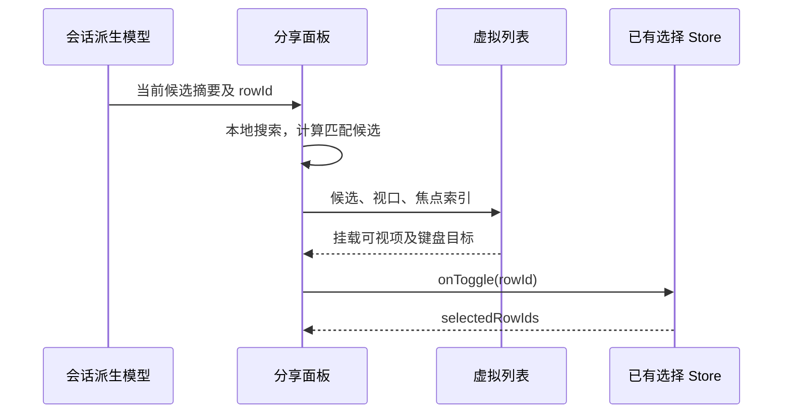

# 长会话目录与分享选择交互

## 产品行为

- 分享候选面板提供“搜索问题或回复摘要”。检索范围明确为当前已加载候选的可见问题/回复摘要，大小写不敏感；不声称搜索全文或尚未加载的历史。
- 搜索只改变显示候选，不改变已经选择的 rowId、预检结果或发布内容；清空搜索恢复全部候选。
- 候选列表使用现有 TanStack Virtual，DOM 规模随视口而不是对话总量增长。每项使用一致的高度和间距，支持窄屏、UI 字号、深浅主题。
- 未勾选的可用候选仍使用清晰可读的正文颜色；勾选以选中背景与 Checkbox 表达，只有运行中禁用项降低文本强调，避免“未选中”看起来像“不可用”。
- 键盘从搜索框用上下方向键进入结果；结果内支持上下、Home/End 导航，Space 选择，Enter 定位。运行中的候选不可选择或定位。键盘跨越虚拟窗口后目标需挂载并获得焦点。
- 面板展开、收起与滚动提示遵循当前系统减少动画偏好；过滤不导致面板超出会话容器。空列表与搜索无结果使用不同文案。

## 派生计算

- 目录摘要保持已有空白折叠、最多两段、默认 220 字符和省略号规则；生成时在足以确定摘要后停止读取剩余文本，避免拼接完整长回复。截断不得留下孤立 UTF-16 高代理项。
- 所有目录调用方共用同一个纯摘要函数；不改变实际聊天内容、复制、导出、存储或全文搜索。
- 分享选择唯一所有者仍是 conversationShareSelectionStore。面板只拥有本地搜索和键盘焦点，候选来自既有按需分享模型，不增加服务/RPC/持久化路径。
- 系统偏好通过 UI hook 共用一个 matchMedia change 监听，首帧读取当前值，并在变更和最后一个消费者卸载时正确同步/清理。复用在目录与分享面板，不新增第三方依赖。
- 工具栏滚动标签、翻转数值和工具摘要复用同一偏好 hook，移除各自重复的初态为 false 的订阅；系统已关闭动画时首帧不再误播动画。

## 验收

1. 摘要与既有规则在空白、空段、多文本块、超长正文、截断边界上一致；超过摘要所需的后续块不被读取；emoji 边界有效。
2. 2,000 项候选挂载数量保持在视口加 overscan 范围；搜索末尾候选、无结果、清空均正常，隐藏的选择不丢失。
3. 键盘跨虚拟窗口、跳到首尾、Space 切换、Enter 定位、运行中禁用；搜索更新后不操作过期 rowId。
4. 分享面板正常关闭与再次打开，不泄漏 ResizeObserver、media listener 或滚动帧回调；减少动画动态变更生效。
5. 浏览器验证桌面/窄屏和深浅主题；执行定向单测、类型检查、lint、架构与格式检查。实际 Host/Agent 分享发布不在纯 UI fixture 中伪造验证。

## 本轮验证结果（2026-10-01）

- 23 项定向测试通过，包含 4 项新摘要测试；既有长会话、分享模型、批量 delta 和兼容行为回归通过。
- 130 万字符 / 25 次摘要样本：全文处理 185.4ms，按需处理 0.6ms。只代表该合成输入；纯空白等需要完整检查的输入仍可能线性扫描。
- 实际分享组件装载 2,000 个合成候选：1258×622 挂载 12 项，390×844 挂载 16 项。搜索、隐藏勾选保留、跨窗口方向键、Home/End、Space/Enter、运行结束、关闭/重开通过。
- 260px 宽分屏容器的边界断言通过；Zai Light 桌面与 Zai Dark 窄屏、18px UI 字号检查无水平溢出。原生键盘 Space 确认只切换一次选择。
- 系统减少动画从 false 动态切换为 true、关闭后重新挂载读取当前偏好通过。六类消费入口共用一个 hook，最后一个消费者退订时释放原生媒体监听。
- 根 typecheck、UI 测试类型检查通过；lint 为 0 错误、63 条既有警告；架构 baseline 0、新增 0。本轮只修改 ui 模块，源码净增 152 行，没有新增依赖。
- 浏览器测试使用合成候选和本地回调，没有调用真实分享发布或启动 Host/Agent。搜索针对已加载摘要，保留完整正文与原有全文搜索；本轮虚拟化的是分享候选列表，不能当作整段聊天已实现恒定内存的证明。

复现命令见 `packages/ui/test/browser/README.md`；源码所有者和事件顺序如上，不改变 CLI admission、远端投影或持久化协议。
