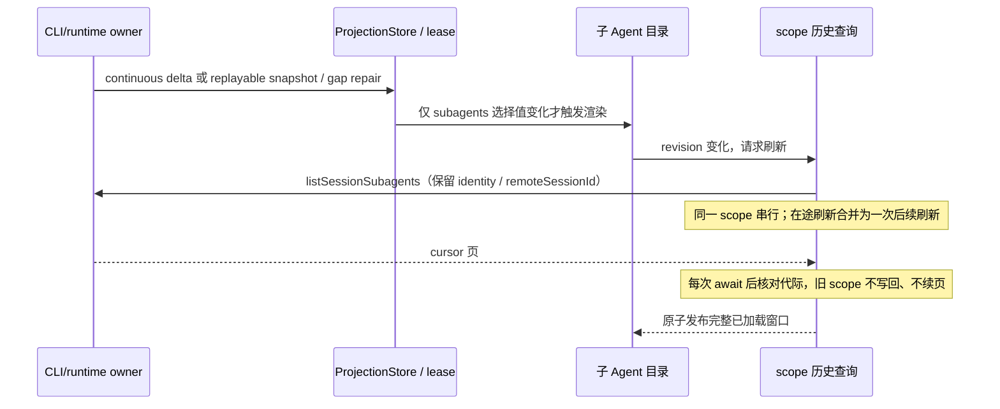

# 子 Agent 目录性能与交互

## 范围与边界

优化派遣后的子 Agent 目录（`SubagentDirectorySidePane`），复用现有子会话侧栏。服务端生命周期、命令 admission、磁盘存储、Agent 配置和协议均不改变。模块为 `ui`（当前架构策略 unmanaged），不引入依赖。

运行状态唯一所有者为 CLI/runtime，经现有 SessionDataLayer lease / ConversationProjectionStore 提供只读投影。`useSessionSubagents` 持有 scope 内的历史分页查询视图；选中行、滚动锚点属于列表局部状态。查询视图不推导运行事实。

Desktop `desktop-continuous` 与手机 `web-remote-replayable` 保持现有恢复语义；本改动仅影响读取与渲染，不改变 owner/lease、跨 Host 路由或事件顺序。scope 包含 workspace identity（trim 后回退 path）、执行 path、remoteSessionId 和 parent session；切换时不显示前一 scope 的条目。

## 产品规则

- 父会话文本或工具输出更新但 subagents 引用未变时，不渲染目录、不读取历史。snapshot 暂无 subagents 时仍可查询历史。
- 历史初次和用户“更多”仍取 20 条。刷新保留已加载深度，并扩展新增终态的数量；重验每页最多 100 条，避免原有后续每页 20 条的串行开销。终态摘要仍由 query 更新，不假定不可变。
- 刷新期间保留可读内容。请求合并而不丢失最新失效通知；切 scope 后立即允许新查询，旧请求结束不能解锁或覆盖新请求。卸载和 StrictMode 重挂均失效旧代际。
- 每次查询只建一次去重/复用索引；重复 cursor 显示可重试错误，不能无限分页或伪成功。失败保留旧列表，并提供重试；缺少服务接口显示失败。
- 运行与已结束条目在同一虚拟列表内，挂载量取决于视口、预加载区及最多一条键盘焦点行，而非历史总数。摘要截为单行展示，完整记录仍可打开。
- 条目采用统一两行布局；单个字体标尺随 UI 字号调整高度，避免每行 ResizeObserver 测量与滚动锚点恢复争用 scrollTop。
- 新终态插入时，非顶部阅读锚点保持；顶部用户继续看到最新项。键盘支持方向键、Home/End、PageUp/PageDown、Enter 打开，Tab 可离开目录，聚焦行不因滚动被回收。
- 使用语义颜色和 `text-ui-*`；状态、时间放在第二行避免窄屏挤占标题。提供中英文加载、空状态、错误与键盘提示；减少动态效果时停用旋转动画。

## 验收与证据

1. 查询单测：在途 refresh 合并、旧 scope/StrictMode 请求拒绝、逐页失效检查、分页去重和重复 cursor、防止丢失已加载深度、失败重试、摘要改变时更新且无变化项复用。
2. 浏览器：大量 running 与 5,000 条 ended；父投影 20Hz 无关更新不增加目录提交；可见挂载条目有上限；记录滚动帧间隔（测试环境指标，不承诺任意设备固定帧率）。
3. 浏览器：跨虚拟窗口键盘导航与打开、焦点保留、新完成项插入锚点、更多与错误重试、scope 隔离；窄屏、亮暗主题与 reduced-motion。
4. 根 `typecheck`、`lint`、架构 changed 与改动文件格式检查。浏览器使用合成数据和本地服务 mock，不启动真实模型任务。

feature graph 的 subagents capability 主要索引配置，本轮补充已验证的目录入口 seed，不据此扩张配置服务的职责。

## 验证记录

2026-10-01，Windows / Node 24.13.0 / 本机 Edge headless：

- `corepack pnpm exec tsx --tsconfig packages/ui/tsconfig.json --test packages/ui/test/sessionSubagentsQuery.test.ts packages/ui/test/visibleProjection.test.ts`：9/9 通过。新增查询测试 8 项，另复验隐藏页面订阅释放与恢复。
- `node packages/ui/test/browser/run-subagent-directory.mjs`：三视口及查询交互全部通过，无浏览器 pageerror。组件在 StrictMode 下验证。每个视口使用 100 个 running 与 5,000 个 ended；采样后插入一条新终态，验证原阅读锚点偏移小于 3px。
- 父投影每秒 20 次无关更新，连续 20 次通知内，目录 selector 消费组件新增渲染次数为 0。此指标不代表整个应用零渲染，也不涵盖真实子 Agent 状态改变。
- 460×800 亮色、375×760 中文暗色、390×844 且 UI 字号 20px，滚动期间最大挂载条目分别为 24、23、22。全部验证 reduced-motion 旋转停止、横向不溢出、Home/End/Enter、Tab 离开、离屏焦点保留。
- 最后一次 120 帧滚动采样 p95 帧间隔分别为 19.2、19.0、15.5ms，最大值分别为 25.0、22.3、22.1ms；当时同时运行根类型检查。较早单独运行采样 p95 约 10ms。数据仅描述本机合成页负载，不能解释为任意硬件或生产 Electron 的帧率保证。
- 查询交互覆盖同路径、同父 session、不同 workspaceIdentity / remoteSessionId 的在途切换，旧请求无写回或续页；“更多”加载至 40/65，失败提示后重试恢复至 20/65。终态 240 条的重验请求为 100/100/40 三页；无变化条目和数组复用引用，新增终态不会挤出已加载尾部。
- `corepack pnpm typecheck`：通过（包含 Desktop main/preload/renderer）。`corepack pnpm lint`：0 errors、63 个既有 warnings。`corepack pnpm architecture:check --changed`：0 violations / 0 baseline / 0 new。
- feature graph YAML 解析、37 个唯一节点、52 条边端点与 rank 校验通过；新增目录 seed 为已跟踪源文件，导出符号存在。图注释引用的 `docs/skills/feature-boundary-graph.md` 当前不存在，本轮不恢复该历史文档。
- 目录与查询五个源文件合计从 415 行变为 688 行，净增 273 行；此外为既有 projection hook 增加 selector、中英文文案和测试。所有状态仍属于上述既有 owner，没有新增运行时或全局事实缓存。

浏览器测试入口为 `packages/ui/test/browser/subagentDirectory.html`，沿用 `vite.config.mjs` 启动本地 5199 服务。截图和原始采样位于忽略目录 `node_modules/.cache/subagent-directory/`。

测试发现并修复两个新增边界：逐行 ResizeObserver 补偿与插入位置恢复相互覆盖导致跳动一行；结果发布后、请求 finally 前的微任务失效通知漏刷。前者改为单字体标尺的统一行高，后者补充请求释放时的续刷检查并有先失败后通过的单测。

限制：浏览器场景挂载真实目录组件、查询 hook 和 selector，服务与 projection 通知使用合成数据；未运行真实模型并发任务、完整 Electron/远程设备端到端链路。历史查询视图内存仍随用户已加载记录增长，虚拟化约束的是 DOM 和渲染量；本轮不改变 CLI 查询成本、实际存储或协议。
