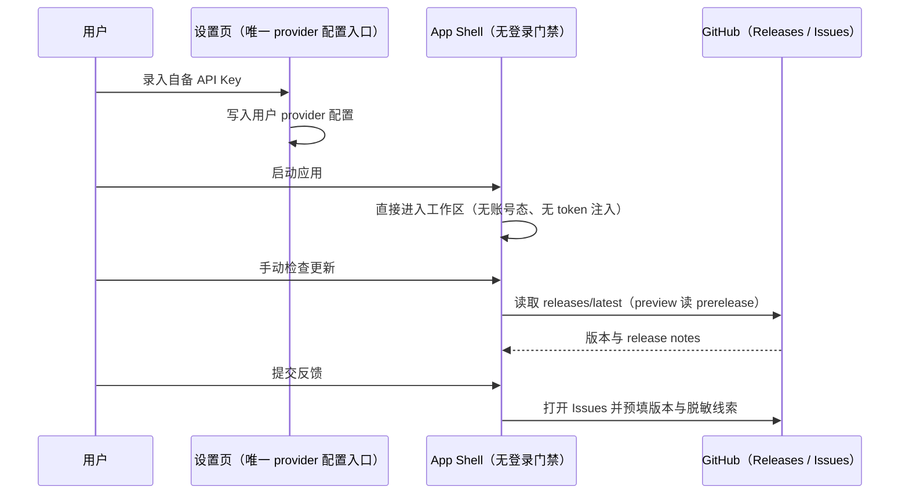

# 开源运行时解耦：上报 / 登录 / 更新 / 反馈

## 产品语义

- 目标形态：安装即用，运行期不依赖任何厂商私有后端（`zcode.z.ai`、`bigmodel.cn`、`api.z.ai` 及其 CDN 清单接口）。
- 客户端不再向任何厂商端点发送遥测：启动、日活、性能帧、渲染轨迹、网络窗口、崩溃富化、CLI OTLP 全部删除。删除范围包含"已经不发送但代码仍在"的半拆除状态。
- 移除账号体系：删除登录页、账号凭据仓储（`oauth:*` / `zcodejwttoken`）、JWT 失效与重认证链路，以及依赖账号的权益判定、Start Plan 额度、闲时任务、用量统计通道。模型提供方完全由用户在设置页自带 API Key 配置，模型列表由用户 provider 配置驱动。
- 内置供应商（Z.ai / BigModel）与其内置模型名单作为运行期概念删除，仅保留用户自建 provider；历史迁移表与遥测白名单按"不再有新数据也需要"处理。
- 反馈改为直连 GitHub Issues：不再上传对象存储、不再有后端 ticket，按钮打开仓库 Issues 并预填版本与脱敏线索。
- 自动更新直连 GitHub Releases：stable 通道读 `latest`，preview 通道读 prerelease；移除私有 manifest provider 与强更（`/api/v1/client/configs` 的 `minimalVersion`）能力。
- 不变式：会话、任务、工作区、分享、Agent 运行时、插件与 MCP 的现有行为不变；不新增状态所有者，不把远端事实改成本地推测。

## 所有者与事件顺序

## 阶段划分

| 阶段 | 内容                                                                                 | 交付判据                                            |
| ---- | ------------------------------------------------------------------------------------ | --------------------------------------------------- |
| P0   | 本 spec 与 feature graph 条目                                                        | spec 落库，随时可被引用                             |
| P1   | 上报删除：UI 埋点叶子 → 桌面/rpc 遥测模块 → services 与 CLI 遥测 → 协议与 IPC 收口   | 全仓无出网点、无 ARMS/OTLP 依赖与开关，静态校验通过 |
| P2   | 登录体系删除：登录页、`user`/JWT marker、`OAuthCredentialRepo`、重认证与 relaunch 链 | 首次启动直接进工作区，设置页可完成凭据配置          |
| P3   | 更新改直连 GitHub Releases：feed provider、发布产物、通道映射、去强更                | 检查更新只访问 GitHub                               |
| P4   | 账号/内置残留清死代码：`account:*`、Coding Plan、闲时、用量、迁移表与 GLM 白名单     | 无账号身份分支，模型列表完全由用户配置驱动          |
| P5   | 死代码与结构收尾（`knip` 与目录归一）                                                | 无未使用导出与重复模块                              |

## 验收

1. 全仓检索不到上报端点、ARMS RUM、OTLP 导出器与对应开关；`@arms/*` 依赖与 patch 移除。
2. 不存在登录入口与账号凭据读写路径；启动不因账号态阻塞；设置页可完成 API Key 配置并发起模型请求。
3. 更新检查只访问 GitHub Releases；preview 通道映射到 prerelease；不存在强更与私有清单接口。
4. 反馈入口打开仓库 Issues；不再有 OSS 直传与后端 ticket。
5. `pnpm typecheck`、`pnpm lint`、`pnpm architecture:check --changed` 通过，受影响包的现有测试通过。
6. 全程不打包、不本地构建安装包、不使用本地开发者工具，构建与安装包由 GitHub Actions 负责。

## 已确认的范围决策（2026-10-01）

- 允许本地运行静态校验（`tsc -b` / `oxlint` / `architecture:check` / 现有测试），不打包。
- 账号通道全删，连带模型可用性门禁、Start Plan 额度、闲时任务、用量面板一起移除。
- 反馈改为直连 GitHub Issues。
- 更新保留 stable + preview（prerelease），移除强更。

## 交付与验证

### 2026-10-01 第一批（P3 部分：启动强更移除）

- 删除 `packages/desktop/src/main/forceUpdateGuard.ts`、`packages/desktop/src/main/forceUpdatePrompt.ts`：两者只为消费私有 `/api/v1/client/configs` 的 `minimalVersion` 存在。
- `packages/desktop/src/main/index.ts`：移除启动期强更 gate（原并行检查 + 命中后销毁主窗口）与其 import。应用启动不再请求私有强更配置，也不再允许远端阻塞启动。
- 保留 `forceUpdateMainWindowCreationBlocked` 标志位与共享层 `resolveForceUpdateRequirement`（当前恒为 false / 无调用方），待死代码阶段与 `knip` 结果一并清理。
- 验证：`pnpm typecheck` 通过；`pnpm lint` 与 `pnpm architecture:check --changed` 见下方命令结果。

### 2026-10-01 P2 第一批（登录 UI 与账号态链路整体移除）

目标形态：**没有任何登录入口、没有任何账号态**。用户首次启动直接进入工作区，模型供应商完全由设置页自备 API Key 驱动。

**删除**

- `packages/ui/src/WelcomeScreen.tsx`、`packages/ui/src/login/LoginApiKeyForm.tsx`、`login/LoginApiKeyForm.helpers.ts`（登录屏与 API Key 首登表单整体删除）。
- `packages/ui/src/root/useRootSessionEffects.ts`、`root/zcodeJwtInvalidRestartMarker.ts`（登录态落定与 JWT 失效重启标记）。
- `packages/ui/src/root/useProviderAvailabilityLoginEntryGuard.ts`（登录入口守卫）。
- `packages/shared/src/oauth.ts` 的 `ZCODE_JWT_INVALID_BROADCAST_CHANNEL`（已无消费方）。
- `packages/shared/src/test-ids.ts` 的 7 个 `TID_LOGIN_*` 与 `TID_LOGOUT_BUTTON`。
- 相应 i18n：`sidebar.profile.notLoggedIn`（zh-CN/en-US）。

**改写**

- store（`packages/ui/src/store/index.ts`）：删除 `user`/`authSessionSeq`/`isRestoringOAuthSession`/`apiKeyLoginSuccessSeq`/`lastApiKeyLoginModel` 及其 setter；`createZCodeStore` 不再接受 options，`StoreProvider` 不再接受 `initialIsRestoringOAuthSession`。
- `Root.tsx`：删除 `welcomeScreenOpenReason` 三态与 `WelcomeScreenOpenReason` 类型、登录/退出处理（`handleOpenLoginEntry`/`handleWelcomeScreenComplete`/`handleReauthenticationRequired`）、`onLogin`/`onLogout`/`user` 透传、`isResolvingStartupAuthState`，以及登录屏渲染分支。
- 启动门禁（`lib/rootStartupGate.ts`）：不再接受账号态与登录页条件，`shouldEnableProviderAvailabilityLoginEntryGuard`（恒为 true）删除。
- 新增 `root/useProviderAvailabilityStartupCheck.ts`：由登录守卫改写为纯启动可用性检查（去掉 `user`/`isRestoringOAuthSession` 入参与恒真 `enabled` 开关）。
- 新增 `root/useRootStartupEffects.ts`：替代 `useRootSessionEffects`，只保留"启动刷新 Provider Runtime"与"通知 RendererReady"两件事。
- 侧边栏底部（`WorkspaceSidebarFooter.tsx`）：头像/用户名/登录态 loading 与登录、退出菜单项改为**偏好设置入口**（语言/主题/模式/缩放/用量），testid 从 `TID_LOGIN_TRIGGER` 改为 `TID_SIDEBAR_SETTINGS_MENU_TRIGGER`。
- 命令面板（`quickpick/quickPickCommands.ts`、`App.tsx`）：删除 login/logout 命令与 `isLoggedIn`。
- 属性链（`app-shell/types.ts`、`WorkspaceShellLayout.tsx`、`RootWorkspaceContent.tsx`、`WorkspaceSettingsLayer.tsx`、`SettingsPage.tsx`、`WorkspaceSidebar.tsx`、`root/types.ts`、`root/useRootWorkspaceActions.ts`）：删除 `onLogin`/`onLogout`/`user` 与 `handleLogout`（含退出确认弹窗、providerFamilyDomain 清除、`RelaunchApp` 调度）及其入参。
- `root/useRootPlatformEffects.ts`：`isRestoringOAuthSession` 入参改名为语义准确的 `providerStartupPending`。

**死代码清理（本轮改动引入的）**

删除 11 处死声明与约 20 处未使用导入：`appTelemetryCredentialService`（desktop main）、`buildRemoteTargetTelemetryKey`（desktop）、`createCommandsService`/`createHooksService`/`createMemoryService` 的未使用装配（services/node）、`reportedErrorKeysRef`（ConversationComposer）、`shouldMeasureExistingSessionOpen`/`telemetryDraftConfig`（SessionPane）、`templateName`（草稿推荐）、代码预览埋点的 `action`/`value`（SettingsPage）、`bumpTaskListVersion`（WorkspaceSidebar）等。lint 告警从 61 降到 39。

**验证**

- `corepack pnpm typecheck`：0 错误。
- `corepack pnpm lint`：0 错误、39 warnings（低于本轮改动前的 61）。
- `corepack pnpm architecture:check --changed`：0 violations / 0 baseline / 0 new。
- `corepack pnpm exec tsx --tsconfig packages/ui/tsconfig.json --test packages/ui/test/*.test.ts`：33/33 通过。
- 全仓检索 `isRestoringOAuthSession|markApiKeyLoginSuccess|WelcomeScreen|useRootSessionEffects|zcodeJwtInvalidRestartMarker|useProviderAvailabilityLoginEntryGuard|TID_LOGIN_|TID_LOGOUT_BUTTON|ZCODE_JWT_INVALID_BROADCAST_CHANNEL`：0 命中。

**本章未做、需要后续决策或处理**

1. **会话分享入口**：`WorkspaceHeaderActionSection` 用 `user` 判断"分享发布接口依赖登录态；未登录时隐藏入口"。账号移除后 `user` 恒为 undefined，分享入口**永久隐藏**，属死分支。需要在 P4 决定：改为本地导出 / GitHub Gist，还是删除该入口与 `conversation-share` 服务。本轮未动。
2. **i18n 孤儿文案**：`login.*`、`app.login`、`app.logout`、`logout.confirm.*`、`quickPick.command.login|logout` 等键已无消费方，待 i18n 统一清理时删除。
3. **预热空实现**：`SessionPane` 的 `reportDraftCreated` 是上报链路移除后留下的空回调，仍被 3 处调用与一处透传引用；为避免改动预热 API 契约，本轮只把入参加 `_` 前缀，待预热链路收口时一并删除。
4. **账号 Provider / Coding Plan / 闲时 / 用量 / 权益 / `oauth:*` 凭据仓储**：属 P3，尚未开始。

### 2026-10-01 P1 第三批（依赖摘除与第三方清单同步）

代码零引用后，实际从依赖图移除遥测包：

- `packages/desktop/package.json`：删除 `@arms/rum-electron`、`@opentelemetry/api`、`@opentelemetry/exporter-metrics-otlp-proto`、`@opentelemetry/exporter-trace-otlp-proto`、`@opentelemetry/resources`、`@opentelemetry/sdk-metrics`、`@opentelemetry/sdk-trace-base`。
- 根 `package.json`：删除 `pnpm.patchedDependencies` 里的 `@arms/rum-electron@0.0.3`；`patches/@arms__rum-electron@0.0.3.patch` 删除（该补丁只为 ARMS RUM 存在）。
- `apps/zcode-cli/packages/bootstrap/package.json`：删除 `@zcode/telemetry` workspace 依赖。
- `pnpm-lock.yaml`：同步更新（-410 行）。`@arms/rum-electron` 及其带出的 `@arms/rum-browser`、`@arms/rum-core` 已从锁文件彻底消失。
- `third-party/npm-overrides.json`：删除 3 条 @arms 许可 override（保留会让下一次清单重生成直接抛 `Stale npm notice override`），并删除它们引用的 3 个 `third-party/upstream/*.txt`。
- `third-party/inventory.json`：重算 `inputs` 哈希并剔除 6 条已删除文件条目（`apps/zcode-cli/packages/telemetry/package.json`、`packages/rpc/src/network-telemetry-middleware.ts`、`@arms` 补丁与 3 个 upstream 记录）。
- 保留 `@opentelemetry/api@1.9.0`：它由 `ai@6.0.159`（Vercel AI SDK）传递引入，是**无导出器的空实现 API**，不产生任何网络上报。

**环境限制（重要，需在无此限制的环境补跑一次）**：本机 `pnpm -r ls --prod --json --depth Infinity` 稳定触发 `EMFILE`（沙箱对子进程句柄的硬上限，串行化 `UV_THREADPOOL_SIZE=1` 与 `--depth 1` 均复现，与 safe-delete shim 无关），因此无法执行 `node scripts/licenses.mjs notices` 全量重生成。本次改用等价修复：按 `readVerifiedNotices` **完全相同的哈希规则**（UTF-8 文本、CRLF→LF 归一化后 sha256）重算 `inventory.inputs`，剔除了已删除文件的条目。已验证 `readVerifiedNotices(root)` 与 `{ requireComplete: true }` 两种模式均通过，`inventory.json` 只变 11 增 18 删。

修复过程中发现 `inventory.inputs` **在本轮之前就已漂移**：`third-party/copied-components.json`、`packages/ui/package.json`、`packages/ui/src/components/ui/flip-metric-value.tsx`、`packages/ui/src/lib/builtinSkillI18n.ts`、`packages/rpc/src/index.ts` 的记录哈希与工作区文件早已不一致（即 `licenses.mjs check --strict` 在改动前就会失败）。本轮已一并同步。

残留：`THIRD-PARTY-NOTICES.md` 与 `inventory.packages` 仍含 @arms / 已移除 @opentelemetry 分支的条目，属于"记录了不再安装的组件"的过期内容，不参与任何哈希校验（`noticesSha256` 与 .md 仍互相一致）。下一次在正常环境执行 `node scripts/licenses.mjs notices` 会自动清干净，且不会再抛 stale override。

### 2026-10-01 P1 第二批（协议、桥接与开关收口）

在第一批删掉实现与调用点之后，这一批清掉"已经没人用、但仍然占体积/占协议面"的残留：

- `packages/shared`：删除 `telemetry.ts`、`telemetryRedaction.ts`、`localTtft.ts`、`processResourceTelemetry.ts`、`sessionCreateTelemetry.ts`、`remoteUsageTelemetry.ts`、`rendererActionTrace.ts`；随之清理 `channels.ts` 上的 telemetry/ARMS/RendererHeapSample/渲染轨迹/E2E 采集通道常量与类型映射、`platform.ts` 上的 `reportTelemetryEvent`/`reportArmsCustomEvent`/`getRendererActionTraceConfig`/`onRendererActionTraceConfigChanged`/`reportRendererActionTraceBatch`/`reportLocalTtftBatch`/`reportRendererHeapSample` 与 `connectTrigger` 字段、`env.ts` 的开关与 ARMS 环境映射、`index.ts` 的对应导出。
- 协议：`zcode-protocol-v4` 与 `zcode-protocol` 移除本地 TTFT 合同（`commandEnvelope.ttft`、ACK 的 `ttftExcluded`、`commandsQueryParams.clock`、`transport.ttft`/`ttftRelated`、`v4/telemetry/local-ttft` topic）。这意味着**不再有任何本地时钟字段被写进发往远端的协议包**。
- `packages/desktop`：`preload/index.ts` 删除 telemetry/ARMS/RendererHeapSample/渲染轨迹/E2E 采集桥与 `__zcodeFinalArmsCustomEventsE2E`；`renderer/src/desktopPlatform.ts` 与 `renderer/src/main.tsx` 删除对应实现与 bootstrap；`shared/armsRumBridgeForward.ts` 与 `main/rendererActionTraceBroker.ts`、`main/rendererActionTraceRollout.ts` 删除。
- `packages/client/src/globals.d.ts`、`packages/web/src/main.tsx`：删除窗口类型与 Web 端空实现。
- 会话资源采样：`processResourceRoleClassifier.ts` 不再依赖已删的共享角色类型，改为就地声明 Chromium 角色集合；`agentLaneResourceSampleSchema` 的 `lane` 改为可选字符串。
- 发送与渲染链路：`ConversationComposer` 删除 `telemetrySeed`/`sendClickId` 落定链、`SessionPane` 删除 supervisor 租约与 `openTrigger`/`telemetryVisible`/`telemetryDraftConfig`、`sessionDataLayer` 删除 `openKind`、`App.tsx` 的 heap 采样出口、`agentConversationTransport` 的 TTFT 校准；`zcodeAgentService`/`zcodeAgent`/`zcodeAgentConnectionScope` 删除 `onDynamicLocalTtftFacts` 与协议包 TTFT 剥离逻辑。
- 验证：`pnpm typecheck` 0 错误；`pnpm lint` 0 错误、61 warnings（基线 63）；`pnpm architecture:check --changed` 0 violations / 0 baseline / 0 new；改动文件已格式化。

**本批未做、需要单独处理的三项**：

1. 依赖摘除（`@arms/rum-electron`、6 个 `@opentelemetry/*`、CLI 的 `@zcode/telemetry`）已确认代码零引用，但删除 `package.json` 条目会让 `pnpm-lock.yaml` 过期，而 CI 使用 `--frozen-lockfile`。必须在允许跑 `pnpm install --lockfile-only` 的环境同步锁文件，同时更新 `patches/`、`third-party/inventory.json` 与 `THIRD-PARTY-NOTICES.md`。代码已不引用这些包，因此这一步不影响功能，只影响安装体积与清单一致性。
2. 会话遥测事实流（`zcode-protocol-v4/telemetry.ts` 的 `conversationTelemetryFact` + `createConversationTelemetryService` + CLI `taskActivityTracker`）仍存活，消费方（UI 附件）已删，属于下一批。
3. 厂商端点与凭据类残留（`zcodeEndpoint.ts`、`zcode-source-headers.ts`、`device/deviceMid.ts`、`feedback/*HttpClient`、`conversation-share/*`、`remoteCdn.ts`、`manifestUpdateProvider.ts`、`agentTelemetryEnv.ts`、CLI `official-coding-plan-gateway.ts`）属于 P2/P3/P4。

### 2026-10-01 P1 第一批（客户端上报链路整体移除）

按"一次删到位、不留禁用壳"执行，删除范围与结果：

- UI：`lib/*Telemetry*`、`userActionTelemetry`、`userActionTraceCatalog`、`messageTelemetry`、`chatErrorAttribution*`、`providerTelemetryIdentity`、`launchToInputReport`、`onboarding/useOnboardingTelemetry`、整个 `v4/telemetry/` 目录；连带解包 39 处 `runUserAction*` 调用点与全部埋点调用。
- Desktop main/host/renderer：ARMS 引导与身份、资源/网络/稳定性/MCP/数据库启动/体积扫描采集、进程采样链（`processResource*`）、本地 TTFT 导出、renderer action trace 与 app telemetry 桥、host 与 scheduler 的资源遥测。
- `packages/rpc`：网络遥测中间件（含 `emitNetworkTelemetryObservation`），同步清理 `services` 适配器的调用点。
- `packages/services`：`telemetry/telemetryCore.ts` 与 `createTelemetryUserIdLoader` / `createTelemetryAuthorizationLoader` / `createTelemetryMarketingParamsLoader`。
- CLI：`apps/zcode-cli/packages/telemetry/**` 整包与 `telemetry-bootstrap`，以及 `create-app` / `runtime-cleanup` / `zcode-protocol-entrypoint` 的装配。
- 会话发送链路：移除 `telemetrySeed` / `sendClickId` / `localTtft` 观测与 `envelope.ttft` 写入（该字段会把本地时钟写进协议包），删除 `SessionPane` 的 supervisor 租约、`openTrigger` / `telemetryVisible` / `telemetryDraftConfig` 等只为埋点存在的 props 与 `sessionDataLayer` 的 `openKind`。

验证：`pnpm typecheck` 通过（0 错误）；`pnpm lint` 0 错误、65 个既有 warnings（基线 63）；`pnpm architecture:check --changed` 0 violations / 0 baseline / 0 new；改动文件已用仓库格式化器处理。

尚未处理（下一批）：`packages/shared` 的 `channels.ts` 通道常量、`platform.ts` 的 `reportTelemetryEvent`/`reportArmsCustomEvent`、`validation.ts` 的遥测 schema、`telemetry.ts`/`localTtft.ts`/`processResourceTelemetry.ts`/`sessionCreateTelemetry.ts`/`remoteUsageTelemetry.ts`、`env.ts` 遥测开关、`desktop/src/preload` 与 `client/src/globals.d.ts`、`web/src/main.tsx` 空实现，以及 `@arms/*` 依赖与 `patches/`、`third-party/inventory.json`。

### P1 执行清单（按包推进，每步结束必须 `tsc -b` 通过）

已实测的删除粒度与依赖顺序（顺序不能颠倒，否则跨包编译失败）：

1. **包内叶子优先**：`packages/ui/src/lib/*Telemetry*.ts`、`userActionTraceCatalog.ts`、`messageTelemetry.ts`、`chatErrorAttribution*.ts`、`providerTelemetryIdentity.ts`、`onboarding/useOnboardingTelemetry.ts`、`v4/telemetry/**`（29 个文件）。已确认这些模块只被埋点消费；`lib/modelVisionBadge.ts`、`lib/memoryDiagnostics.ts` 仍被非遥测 UI 使用，**不得删除**。
2. **包装器解包**：`runUserAction` / `runUserActionAsync` 共 36 处调用点，可用确定性 codemod 按"取 `operation` 属性 + 括号包裹后调用"解包；`startUserAction` 还需额外处理其返回的 tracer（`trace.complete` / `trace.fail`）与 `SettingsPage` 的 `UserActionTrigger`/`UserActionResult` 类型。
3. **两个高耦合文件必须单独设计，不能机械替换**：
   - `packages/ui/src/v4/ConversationComposer.tsx`：`telemetrySeed` / `sendClickId` 落定链、`telemetryDraftConfig`、`telemetryVisible`、`heldQueueConfirmation.telemetrySeed`、`localTtft` 观测点共约 40 处。
   - `packages/ui/src/v4/SessionPane.tsx`：`useScopedConversationTelemetrySupervisor` 租约、`useSessionOpenArmsTelemetry`、`reportSessionCreate`、`envelope.ttft` 写入（会把本地 TTFT 写进协议包，属"发往远端"）共约 30 处。
4. **桌面端**：`desktop/src/main` 遥测与 `processResource*` 采样链、`desktop/src/host/**Telemetry*`、`desktop/src/shared/armsRumShared.*`、`desktop/src/renderer/{userActionTraceBootstrap,localTtftBootstrap}.ts`；其中 `desktopStabilityTelemetry` 的崩溃监听需改为直接调用 `registerCrashEventMonitor`，`processResourceRoleClassifier`/`processResourceAppTotals` 供资源管理窗口，必须保留。
5. **`services` 与 `rpc` 同批**：删 `rpc/network-telemetry-middleware.ts` 会连带 `services/src/zcode-agent/zcodeTaskServiceAdapter.ts` 的 `emitNetworkTelemetryObservation`，两者必须同批；删 `services/src/telemetry/telemetryCore.ts` 会连带 `desktop/src/main/index.ts` 的 `createTelemetryCore` 装配。
6. **CLI**：`apps/zcode-cli/packages/telemetry/**` + `bootstrap/src/telemetry-bootstrap.ts` + `create-app.ts` / `runtime-cleanup.ts` / `zcode-protocol-entrypoint.ts` 装配；`adapters/src/mcp/telemetry.ts`、`adapters/src/exec/bash-resource-telemetry.ts`、`adapters/src/model/runner-telemetry.ts` 承载本地诊断，**保留**。
7. **最后才动 `shared`**：`channels.ts` 通道常量与契约表、`platform.ts` 的 `reportTelemetryEvent`/`reportArmsCustomEvent`、`validation.ts` 的 `armsCustomEventPayloadSchema`、`telemetry.ts`/`localTtft.ts`/`processResourceTelemetry.ts`/`sessionCreateTelemetry.ts`/`remoteUsageTelemetry.ts`、`env.ts` 的遥测开关；同步 `desktop/src/preload`、`client/src/globals.d.ts`、`web/src/main.tsx` 空实现与 `@arms/*` 依赖、patch、`third-party/inventory.json`。
8. 每步结束执行：`pnpm typecheck`、`pnpm lint`、`pnpm architecture:check --changed`；删除导出前用 `pnpm dep:refs` 确认无引用。

其余阶段待完成后追加。
