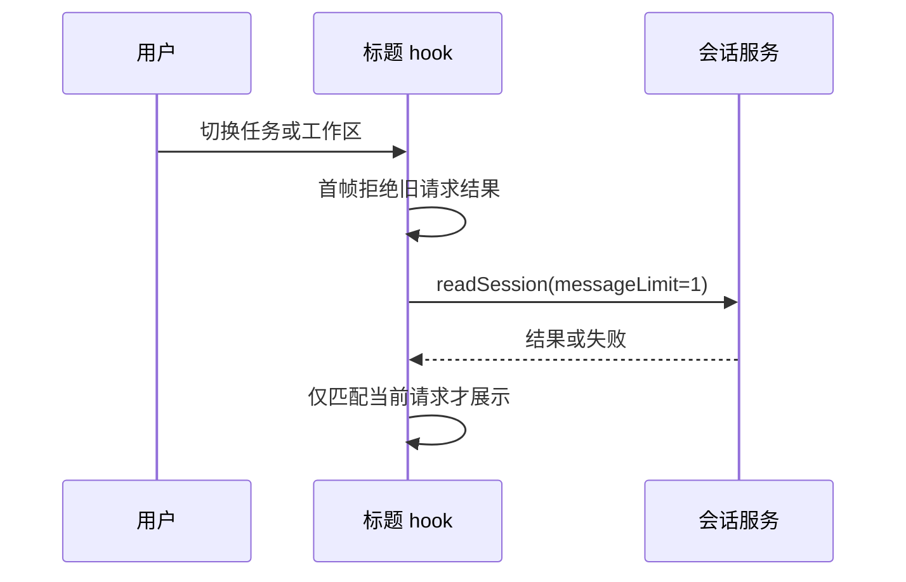
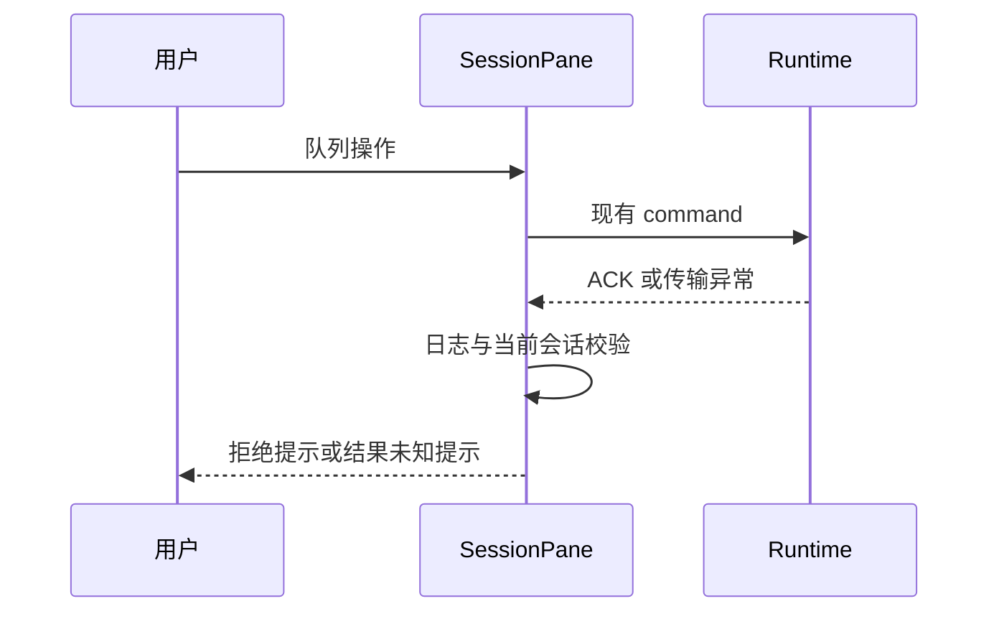

# 任务切换首帧与队列失败反馈

## 用户规则

- 切换任务时标题不能闪现上一任务内容；同 taskId、同路径但不同 workspace identity 或远端连接也必须隔离。
- 列表已有任务 meta 时使用列表来源，不额外读取 snapshot；列表 meta 引用变化不应反复触发无用清理。
- 已离开的读取请求返回后不能更新当前任务；失败清空当前兜底并记录诊断。
- 删除、立即发送、排序、恢复队列操作的 rejected/stale/failed ACK 必须给出可见失败提示。
- 网络异常只能提示“未能确认结果，请检查队列状态”，不能声称命令没执行或自动重新提交。
- accepted/noop 不提示失败。duplicate 表示去重回执，不擅自当作新的接受结果；沿用已有队列操作成功语义。
- 提示不得带内部协议字段；区分操作类别，中英文一致。
- 切换到其他会话后，旧操作迟到的失败只记日志，不在新会话弹误导提示。

## 所有权与时序

标题兜底 hook 独立拥有请求结果，结果携带请求身份；渲染时先比对当前身份再返回。
请求身份包括 workspaceIdentity 的标准 fallback、实际 workspacePath、taskId、远端连接和 service 实例。
队列权威状态仍归 runtime，UI 只处理请求结果和提示；不增加自动重试或新的队列。

## 验收

- 浏览器记录每次 commit：A→B 的首帧、相同 taskId 不同 identity、连接切换、列表来源覆盖、乱序回包和卸载。
- 队列结果定向测试覆盖成功、拒绝、异常、过期会话；确认无重发、无假成功，通知只触发一次。
- 浏览器以真实 toast 和队列控件配合合成命令回包验证可见反馈，明确不等同于真实 Agent 端到端。
- 运行定向测试、Lint、类型和架构检查；并行清理的基线失败单独记录，不修改清理范围。
